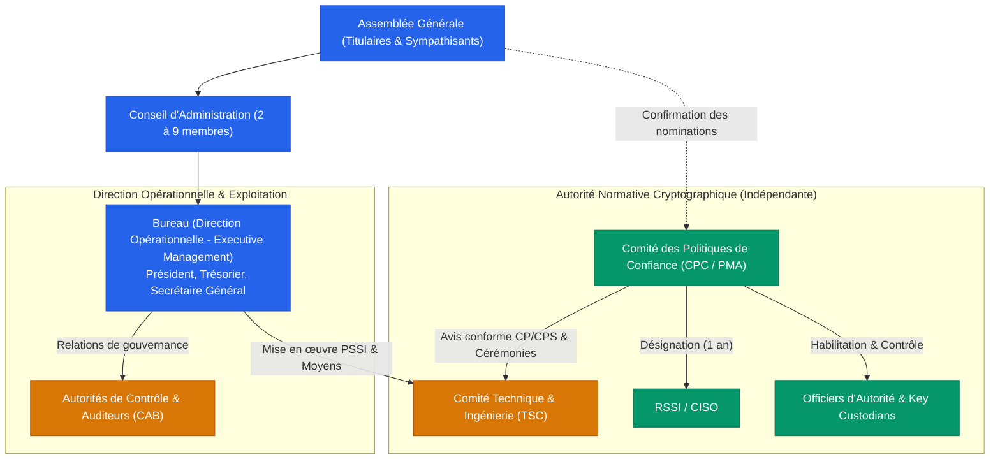

:material-shield-check: Association d'intérêt général (loi 1901) en cours de constitution

# Open Trusted Service Provider Initiative

Construire, opérer et pérenniser des <strong>infrastructures de confiance numérique ouvertes, souveraines et universellement accessibles</strong>, conformes aux standards eIDAS 2.0, ETSI et WebTrust sous gouvernance strictement désintéressée.

[:material-book-open-page-variant: Consulter le projet de statuts](statuts/statuts-association.md){ .md-button .md-button--primary }
[:material-draw-pen: Signer le Manifeste](https://www.otspi.org/manifeste.html){ .md-button }
[:material-github: Dépôt GitHub](https://github.com/otspi/organisation){ .md-button target="_blank" }

🏛️

100% Intérêt Général

Gestion désintéressée, bénévolat strict des dirigeants, inaliénabilité des logiciels libres et des marques.

🇪🇺

eIDAS 2.0 & ETSI

Services de confiance qualifiés : horodatage, signature, scellement et archivage probatoire sous audit CAB.

⚖️

Séparation des Devoirs

Indépendance absolue du Comité des Politiques de Confiance (CPC) vis-à-vis du Bureau exécutif.

🔍

Redevabilité Intégrale

Transparence totale des PV, budgets prévisionnels, rapports d'audit et politiques de certification (CP/CPS).

---

## 📚 Explorer la Documentation et les Textes Fondateurs

-   :material-scale-balance:{ .lg .middle } __Statuts & Gouvernance__

    ---

    Le projet de statuts constitutifs, soumis au vote de l'assemblée générale constitutive, fondé sur l'intérêt général (CGI art. 200 & 238 bis), la gestion désintéressée et la séparation stricte des devoirs.

    [:octicons-arrow-right-24: Consulter le projet de statuts](statuts/statuts-association.md)  
    [:octicons-arrow-right-24: Charte d'Éthique & Déontologie](gouvernance/charte-ethique.md)  
    [:octicons-arrow-right-24: Organisation Technique & CPC](gouvernance/comite-technique.md)

-   :material-book-open-page-variant:{ .lg .middle } __Règlement Intérieur__

    ---

    Fonctionnement opérationnel : cursus d'habilitation des Officiers d'Autorité, clés matérielles FIPS/ANSSI et règles de fonctionnement de l'association.

    [:octicons-arrow-right-24: Règlement Intérieur](reglement-interieur/reglement-interieur.md)

-   :material-certificate:{ .lg .middle } __Socle de Conformité (TSP / PKI)__

    ---

    Le référentiel d'audit initial conforme aux normes eIDAS, ETSI et WebTrust : Cadre CP/CPS (RFC 3647), Politique de Sécurité (PSSI) et Fin d'Activité.

    [:octicons-arrow-right-24: Cadre Général CP/CPS](cadrage/cp-cps-cadre.md)  
    [:octicons-arrow-right-24: Politique de Sécurité (PSSI ISO 27001)](cadrage/pssi.md)  
    [:octicons-arrow-right-24: Plan de Fin d'Activité (Termination Plan)](cadrage/termination-plan.md)

-   :material-file-document-outline:{ .lg .middle } __Démarches Légales & Fiscales__

    ---

    Dossier juridique complet : Procès-Verbal de l'AG Constitutive, demande formelle de rescrit fiscal mécénat DGFIP et guide d'immatriculation.

    [:octicons-arrow-right-24: Procès-Verbal Constitutif (Modèle)](administratif/pv-ag-constitutive-modele.md)  
    [:octicons-arrow-right-24: Dossier de Rescrit Fiscal DGFIP](administratif/rescrit-fiscal-mecenat.md)  
    [:octicons-arrow-right-24: Guide Préfecture (RNA, SIRET)](administratif/declaration-prefecture.md)

---

## 🏛️ La Confiance Numérique comme Bien Commun

L'association **« Open Trusted Service Provider Initiative » (OTSPI)**, en cours de constitution, a pour but d'intérêt général de lever les barrières économiques, techniques, administratives et éducatives à la sécurité, à la confidentialité et à la confiance numérique dans les communications électroniques mondiales.

À l'instar du modèle d'infrastructure d'intérêt général développé par l'**ISRG (*Let's Encrypt*)** pour le chiffrement du Web :

* **Infrastructures ouvertes et universelles** : Nous concevons, opérons et pérennisons des services de confiance qualifiés (horodatage électronique qualifié, scellement, signature numérique, archivage probatoire, gestion des identités) conformes aux règlements européens **eIDAS / eIDAS 2.0** et aux standards internationaux **ETSI** et **WebTrust**.
* **Gestion strictement désintéressée** : Bénévolat strict des dirigeants, inaliénabilité des dépôts logiciels libres et des marques, absence de distribution d'actifs et réinvestissement intégral des excédents dans la mission d'intérêt général.
* **Garantie de continuité opérationnelle** : Un fonds de réserve sanctuarisé garantit l'exécution intégrale du plan de fin d'activité (*Termination Plan*, maintien des listes de révocation CRL/OCSP pendant au moins 10 ans).

---

## ⚖️ Architecture de Gouvernance et Ségrégation des Fonctions

La gouvernance d'OTSPI applique une séparation stricte des devoirs conformément aux normes ETSI EN 319 401 et WebTrust :

1. **Direction Opérationnelle (*Executive Management*)** : Assurée par le Bureau issu du Conseil d'Administration. Il porte la responsabilité juridique et financière, alloue les ressources de sécurité et assure les relations de gouvernance.
2. **Comité des Politiques de Confiance (CPC / PMA)** : Organe collégial indépendant garant de la rigueur cryptographique et normative. Il approuve les CP/CPS, valide les cérémonies de clés, supervise l'habilitation des Officiers d'Autorité et désigne le RSSI. **L'appartenance au Bureau est strictement incompatible avec le CPC.**
3. **Officiers d'Autorité & Gardiens de Clés (*Key Custodians*)** : Opérateurs habilités assurant sous contrôle à quatre yeux (*Dual Control*) les cérémonies de clés et disposant d'un pouvoir autonome de **révocation d'urgence** sans délai.

---

## 🔍 Redevabilité Publique Intégrale (*Public Accountability*)

OTSPI applique un principe de **transparence radicale et d'auditabilité publique** :
- Ordres du jour, débats et comptes-rendus publics des réunions (CA, Bureau, Assemblées Générales, comités techniques) ;
- Budgets prévisionnels, comptes annuels certifiés, rapports moraux et rapports d'évaluation d'audit (ETSI / eIDAS / WebTrust) ;
- Dépôt public de l'ensemble des sources et des documents de gouvernance sur [GitHub : `otspi/organisation`](https://github.com/otspi/organisation).

> [!NOTE]
> **Réserves de protection légitimes :**  
> Conformément à notre projet de statuts, les seules exceptions à la publication intégrale concernent la **protection des données personnelles (RGPD)** de nos membres et votants (données nominatives caviardées), les **secrets cryptographiques matériels** (clés protégées sous HSM) et l'**embargo temporaire de sécurité** lors du traitement coordonné de vulnérabilités critiques (*Coordinated Vulnerability Disclosure — CVD*).

---

## 📬 Contact & Adresses Officielles

- **Contact unique (Informations, Partenariats, Sécurité)** : `contact@otspi.org`  
  *(Pour le signalement de vulnérabilités / CVD : indiquer `[Sécurité]` en objet ou utiliser les [GitHub Private Security Advisories](https://github.com/otspi/organisation/security/advisories))*
- **Dépôt Git de gouvernance** : [github.com/otspi/organisation](https://github.com/otspi/organisation)
- **Portail d'information** : [about.otspi.org](https://about.otspi.org)
