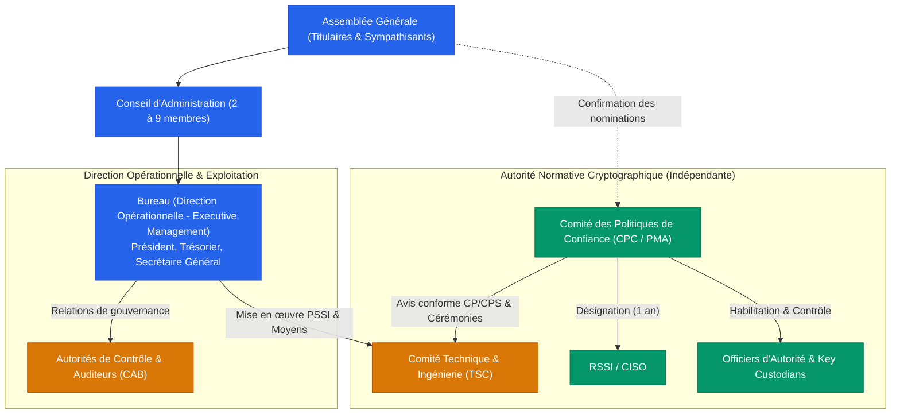

# Open Trusted Service Provider Initiative (OTSPI)
## Portail Officiel de Gouvernance, Statuts et Conformité

-   :material-scale-balance:{ .lg .middle } **Statuts & Gouvernance**

    ---

    Découvrez les statuts constitutifs fondés sur l'intérêt général et la gestion désintéressée, ainsi que la stricte séparation des devoirs entre le Bureau exécutif et le Comité des Politiques de Confiance (CPC).

    [:octicons-arrow-right-24: Consulter les Statuts](statuts/statuts-association.md) · [:octicons-arrow-right-24: Charte d'Éthique](gouvernance/charte-ethique.md)

-   :material-book-open-page-variant:{ .lg .middle } **Règlement & Adhésion**

    ---

    Règles pratiques de fonctionnement : cursus d'habilitation des Officiers d'Autorité, clés matérielles FIPS/ANSSI, barème des cotisations et formulaires d'adhésion.

    [:octicons-arrow-right-24: Règlement Intérieur](reglement-interieur/reglement-interieur.md) · [:octicons-arrow-right-24: Adhérer à l'association](adhesion/bulletin-adhesion.md)

-   :material-certificate:{ .lg .middle } **Socle de Conformité (TSP / PKI)**

    ---

    Le référentiel d'audit initial conforme aux normes eIDAS, ETSI et WebTrust : Cadre CP/CPS (RFC 3647), Politique de Sécurité (PSSI ISO 27001) et Plan de fin d'activité (*Termination Plan*).

    [:octicons-arrow-right-24: Cadre CP/CPS](cadrage/cp-cps-cadre.md) · [:octicons-arrow-right-24: PSSI](cadrage/pssi.md) · [:octicons-arrow-right-24: Termination Plan](cadrage/termination-plan.md)

-   :material-file-document-outline:{ .lg .middle } **Démarches & Légalité**

    ---

    Documents légaux et administratifs : Procès-Verbal de l'Assemblée Générale Constitutive, dossier officiel de rescrit fiscal (mécénat DGFIP) et démarches d'immatriculation.

    [:octicons-arrow-right-24: PV Constitutif](administratif/pv-ag-constitutive-modele.md) · [:octicons-arrow-right-24: Rescrit Fiscal DGFIP](administratif/rescrit-fiscal-mecenat.md)

---

## 🏛️ La Confiance Numérique comme Bien Commun

L'association **« Open Trusted Service Provider Initiative » (OTSPI)** a pour but d'intérêt général de lever les barrières économiques, techniques, administratives et éducatives à la sécurité, à la confidentialité et à la confiance numérique dans les communications électroniques mondiales.

À l'instar du modèle d'infrastructure d'intérêt général développé par l'**ISRG (*Let's Encrypt*)** pour le chiffrement du Web :

* **Infrastructures ouvertes et universelles** : Nous concevons, opérons et pérennisons des services de confiance qualifiés (horodatage électronique qualifié, scellement, signature numérique, archivage probatoire, gestion des identités) conformes aux règlements européens **eIDAS / eIDAS 2.0** et aux standards internationaux **ETSI** et **WebTrust**.
* **Gestion strictement désintéressée** : Bénévolat strict des dirigeants, inaliénabilité des dépôts logiciels libres et des marques, absence de distribution d'actifs et réinvestissement intégral des excédents dans la mission d'intérêt général.
* **Garantie de continuité opérationnelle** : Un fonds de réserve sanctuarisé garantit l'exécution intégrale du plan de fin d'activité (*Termination Plan*, maintien des listes de révocation CRL/OCSP pendant au moins 10 ans).

---

## ⚖️ Architecture de Gouvernance et Ségrégation des Fonctions

La gouvernance d'OTSPI applique une séparation stricte des devoirs conformément aux normes ETSI EN 319 401 et WebTrust :

1. **Direction Opérationnelle (*Executive Management*)** : Assurée par le Bureau issu du Conseil d'Administration. Il porte la responsabilité juridique et financière, alloue les ressources de sécurité et assure les relations de gouvernance.
2. **Comité des Politiques de Confiance (CPC / PMA)** : Organe collégial indépendant garant de la rigueur cryptographique et normative. Il approuve les CP/CPS, valide les cérémonies de clés, supervise l'habilitation des Officiers d'Autorité et désigne le RSSI. **L'appartenance au Bureau est strictement incompatible avec le CPC.**
3. **Officiers d'Autorité & Gardiens de Clés (*Key Custodians*)** : Opérateurs habilités assurant sous contrôle à quatre yeux (*Dual Control*) les cérémonies de clés et disposant d'un pouvoir autonome de **révocation d'urgence** sans délai.

---

## 🔍 Redevabilité Publique Intégrale (*Public Accountability*)

OTSPI applique un principe de **transparence radicale et d'auditabilité publique** :
- Ordres du jour, débats et comptes-rendus publics des réunions (CA, Bureau, Assemblées Générales, comités techniques) ;
- Budgets prévisionnels, comptes annuels certifiés, rapports moraux et rapports d'évaluation d'audit (ETSI / eIDAS / WebTrust) ;
- Dépôt public de l'ensemble des sources et des documents de gouvernance sur [GitHub : `open-eidas/organisation`](https://github.com/open-eidas/organisation).

> [!NOTE]
> **Réserves de protection légitimes :**  
> Conformément à nos statuts, les seules exceptions à la publication intégrale concernent la **protection des données personnelles (RGPD)** de nos membres et votants (données nominatives caviardées), les **secrets cryptographiques matériels** (clés protégées sous HSM) et l'**embargo temporaire de sécurité** lors du traitement coordonné de vulnérabilités critiques (*Coordinated Vulnerability Disclosure — CVD*).

---

## 📬 Contacts & Adresses Officielles

- **Général & Adhésions** : `contact@otspi.org`
- **Signalement de vulnérabilités (CVD)** : `security@otspi.org` *(avec mention `[Sécurité]` en objet)*
- **Dépôt Git de gouvernance** : [github.com/open-eidas/organisation](https://github.com/open-eidas/organisation)
- **Portail d'information** : [about.otspi.org](https://about.otspi.org)
