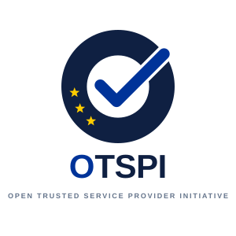

{ .wp-cover-logo }

Livre blanc

Une infrastructure de services de confiance qualifiés d'utilité publique pour eIDAS 2.0

Open Trusted Service Provider Initiative (OTSPI) Document de consultation publique — version 0.9 Septembre 2026

Licence Creative Commons Attribution 4.0 International · contact@otspi.org

# Livre Blanc OTSPI
## Une infrastructure de services de confiance qualifiés d'utilité publique pour eIDAS 2.0

<a class="md-button md-button--primary" href="otspi-livre-blanc.pdf" download>Télécharger la version PDF de référence</a>
<a class="md-button" href="https://github.com/otspi/organisation/discussions/new?category=ideas">Commenter le livre blanc</a>

La version PDF n'est pas entièrement conforme à la norme d'accessibilité PDF/UA. La présente page (HTML) est la version accessible de référence.

| | |
|---|---|
| **Émetteur** | Initiative « Open Trusted Service Provider Initiative » (OTSPI), association loi 1901 en cours de constitution |
| **Statut du document** | Document de consultation publique — version 0.9 |
| **Date** | Septembre 2026 |
| **Destinataires** | Administrations, décideurs publics, organes de contrôle, organismes d'évaluation de la conformité (CAB), hébergeurs, laboratoires de recherche, écosystème open source |
| **Licence** | Creative Commons Attribution 4.0 International (CC-BY-4.0) |
| **Contact** | [contact@otspi.org](mailto:contact@otspi.org) |

!!! note "Nature du document"
    Le présent livre blanc expose une intention et une architecture cible. Il ne constitue ni une Politique d'Horodatage, ni une Déclaration des Pratiques de Certification (DPC), ni un engagement contractuel de service. Les références à des produits ou fournisseurs sont données à titre indicatif ; leur sélection définitive relèvera de procédures de mise en concurrence et de l'approbation du Comité des Politiques de Confiance (CPC).

    OTSPI est en cours de constitution : ses statuts sont à l'état de **projet**, soumis au vote de l'assemblée générale constitutive. Les garanties statutaires décrites dans ce document (objet intangible, inaliénabilité, fonds de réserve, gouvernance) s'appliqueront à compter de leur adoption.

    Une [traduction anglaise](../white-paper/index.md) de ce livre blanc est disponible ; la présente version française fait foi.

### Sommaire

- [1. Résumé exécutif](#1-resume-executif)
- [2. Défaillance de marché et enjeux de souveraineté](#2-defaillance-de-marche-et-enjeux-de-souverainete)
- [3. Cas d'usage pilote : l'horodatage électronique qualifié (QTSA)](#3-cas-dusage-pilote-lhorodatage-electronique-qualifie-qtsa)
- [4. Architecture de sécurité et modèle de confiance](#4-architecture-de-securite-et-modele-de-confiance)
- [5. Modèle économique et pérennité](#5-modele-economique-et-perennite)
- [6. Feuille de route et appel à consultation](#6-feuille-de-route-et-appel-a-consultation)
- [Annexe A — Glossaire](#annexe-a-glossaire)
- [Annexe B — Références normatives](#annexe-b-references-normatives)
- [Annexe C — Sources et méthodologie des données chiffrées](#annexe-c-sources-et-methodologie-des-donnees-chiffrees)

---

## 1. Résumé exécutif

-   :material-card-account-details-outline: **Identité numérique**

    **J-91**{ .wp-value }

    à la date de publication : au 24 décembre 2026, chacun des 27 États membres doit fournir un portefeuille européen d'identité numérique[^eudi].

-   :material-file-document-outline: **Facture électronique**

    **10 millions**{ .wp-value }

    d'acteurs économiques concernés par la facturation électronique obligatoire en France[^eco].

-   :material-currency-eur: **Coût de la preuve**

    **10 000 € HT / an**{ .wp-value }

    pour horodater 15 000 documents par mois auprès d'un prestataire qualifié, au tarif public (cf. § 2.1).

-   :material-lock-open-variant-outline: **Engagement OTSPI**

    **0 €**{ .wp-value }

    pour le service de base, identique pour tous et sans contrat préalable ; seuls les engagements renforcés donnent lieu à contribution (cf. § 5.4).

-   :material-autorenew: **Certificats Web**

    **47 jours**{ .wp-value }

    de validité maximale en 2029, contre 398 jours en 2025 : près de huit renouvellements par an et par site[^sc081].

-   :material-alert-outline: **Dépendance**

    **64 %**{ .wp-value }

    des sites Web reposent sur une seule autorité de certification, établie hors de l'Union[^w3techs].

### 1.1. Le constat

Le Règlement (UE) 2024/1183, dit **eIDAS 2.0**, modifiant le Règlement (UE) n° 910/2014, fait entrer les services de confiance dans l'usage courant. Le calendrier est désormais fixé par les actes d'exécution adoptés en novembre 2024[^eudi] :

- **24 décembre 2026** : chaque État membre doit mettre à disposition au moins un **Portefeuille européen d'identité numérique (EUDI Wallet)** (article 5 bis) ;
- **24 décembre 2027** : les parties utilisatrices privées tenues de recourir à une authentification forte (banque, énergie, transports, santé, télécommunications, éducation, infrastructures numériques, etc.), à l'exception des micro et petites entreprises, doivent l'accepter à la demande de l'utilisateur (article 5 septies).

Ces échéances vont multiplier les besoins en signatures, cachets, horodatages et attestations électroniques qualifiés.

Le marché européen des **Prestataires de Services de Confiance Qualifiés (QTSP)** compte un nombre significatif d'opérateurs : au 24 septembre 2026, les listes de confiance nationales de l'EEE recensent **280 QTSP** disposant d'au moins un service qualifié actif, dont **158 proposant un service d'horodatage électronique qualifié**[^tl]. Le verrou n'est donc pas le nombre d'acteurs, mais l'**homogénéité de leur modèle d'accès** :

- interfaces propriétaires encapsulant les protocoles normalisés ;
- tarification à l'unité (au jeton, à la transaction ou à la signature), souvent assortie d'un abonnement et de frais de mise en service ;
- contractualisation préalable systématique, inadaptée aux usages automatisés, à forte volumétrie et à faible valeur unitaire ;
- marchés largement cloisonnés par État membre, en dépit de la reconnaissance mutuelle prévue par le règlement.

### 1.2. La thèse

En l'absence d'une infrastructure qualifiée **non marchande, ouverte et automatisable par API**, eIDAS 2.0 risque un échec d'adoption auprès des acteurs qui ne disposent ni des budgets ni des équipes juridiques pour négocier avec les QTSP commerciaux : PME, collectivités territoriales, établissements d'enseignement supérieur et de recherche, associations, et l'ensemble de l'écosystème du logiciel libre.

L'enjeu dépasse le seul coût : il touche à l'**indépendance des citoyens** dans leurs relations numériques et à la **liberté d'entreprendre**. La facturation électronique obligatoire (depuis le 1er septembre 2026 en France), l'identité numérique européenne et les futurs portefeuilles d'entreprise ouvrent la voie à une automatisation de bout en bout des échanges entre citoyens, entreprises et administrations. Cette fluidification ne profitera à tous que si les briques de preuve qui la sous-tendent sont accessibles sans droit d'entrée (cf. § 2.3).

La valeur probante conférée par le règlement — présomption d'exactitude de la date et de l'heure pour l'horodatage qualifié (article 41), équivalence juridique de la signature qualifiée à la signature manuscrite (article 25) — resterait alors l'apanage des organisations les mieux dotées.

### 1.3. La réponse

OTSPI propose de constituer un **QTSP d'utilité publique**, porté par une association d'intérêt général à gestion désintéressée, en cours de constitution, dont :

- l'intégralité de la pile logicielle est publiée sous **licence publique de l'Union européenne (EUPL 1.2)**, licence libre à réciprocité, et reste auditable par tous ;
- la gouvernance applique une ségrégation stricte des fonctions conforme à l'ETSI EN 319 401 ;
- les services sont exposés par des API normalisées (RFC 3161, ETSI EN 319 422, ACME), sans tarification à l'unité pour les usages d'intérêt général ;
- le périmètre couvre, conformément à l'objet statutaire, l'ensemble de la chaîne de confiance : gestion des identités, infrastructures à clés publiques, horodatage, scellement, signature, archivage probatoire et validation de preuves ;
- le **projet de statuts** rend l'objet d'intérêt général, la gestion désintéressée et l'inaliénabilité des actifs **intangibles**, et interdit à perpétuité toute transformation en entité lucrative : l'infrastructure est conçue comme un **commun numérique et de l'identité**, protégé contre toute capture (cf. § 5.2).

Le premier service visé est l'**horodatage électronique qualifié** (QTSA), conforme aux normes ETSI EN 319 421 et ETSI EN 319 422.

Le second axe est une **autorité de certification TLS européenne** à deux branches : une branche **DV**, auditée WebTrust, entièrement automatisée par ACME et sans compte préalable ; une branche **OV / QWAC**, dont les certificats sont reconnus à la fois par les navigateurs et comme certificats qualifiés eIDAS. La réduction programmée de la durée de validité des certificats TLS à 47 jours d'ici 2029 fait de l'automatisation une obligation de fait pour tous les sites Web européens (cf. § 2.4).

Suivront, en volets menés en parallèle, le cachet et la signature électroniques qualifiés et les services d'identité adossés à l'EUDI Wallet et aux portefeuilles d'entreprise (cf. § 2.5 et § 6.1).

### 1.4. Le parallèle

En 2015, le marché des certificats TLS présentait des caractéristiques comparables : prix élevés pour un acte techniquement automatisable, procédures manuelles, et, en conséquence, moins de 30 % des chargements de pages Web chiffrés. L'**Internet Security Research Group (ISRG)**, structure à but non lucratif, a émis le premier certificat **Let's Encrypt** le 14 septembre 2015, en fondant son modèle sur trois principes : gratuité, automatisation (protocole ACME, normalisé depuis en RFC 8555) et transparence. Dix ans plus tard, environ 80 % des chargements de pages sont chiffrés à l'échelle mondiale (près de 95 % aux États-Unis), et Let's Encrypt émet fréquemment plus de dix millions de certificats par jour pour près d'un milliard de sites[^le].

OTSPI transpose cette approche aux services qualifiés eIDAS, en assumant les différences structurelles entre les deux contextes (cf. § 2.6).

!!! abstract "Synthèse"
    - **Problème** : eIDAS 2.0 généralise le besoin de services qualifiés (échéances : décembre 2026 et décembre 2027), dans un marché dont les 280 opérateurs partagent un même modèle fermé, contractualisé et tarifé à l'unité.
    - **Conséquence** : exclusion de fait des PME, collectivités, universités et projets open source.
    - **Proposition** : un QTSP associatif, à code ouvert et gouvernance publique, couvrant toute la chaîne de confiance, protégé par un projet de statuts intangibles qui en fera un commun numérique inaliénable.
    - **Premier service** : horodatage électronique qualifié (ETSI EN 319 421 / 422, RFC 3161).
    - **Axes suivants** : autorité de certification TLS européenne auditée WebTrust (DV / OV) ; cachet, signature et identité en parallèle.
    - **Enjeu de société** : indépendance des citoyens et liberté d'entreprendre face à la généralisation de la facturation électronique et de l'identité numérique.
    - **Référence méthodologique** : ISRG / Let's Encrypt.

---

## 2. Défaillance de marché et enjeux de souveraineté

### 2.1. Inadéquation des offres commerciales aux besoins de l'open source et de l'innovation publique

L'offre actuelle des QTSP commerciaux a été conçue pour des clients grands comptes et pour des parcours de signature transactionnels. Elle répond mal à trois catégories de besoins pourtant structurants pour eIDAS 2.0.

**a) L'intégration automatisée à forte volumétrie.**
Une chaîne d'intégration continue qui horodate chaque artefact de compilation, un système d'archivage électronique qui scelle chaque versement, ou une plateforme de dépôt de code qui horodate chaque étiquette de version génèrent des volumes élevés d'opérations à faible valeur unitaire. La tarification au jeton rend ces usages économiquement irrationnels, alors même qu'ils constituent le socle de la preuve numérique à long terme.

Les grilles tarifaires publiques de QTSP inscrits sur les listes de confiance en donnent l'ordre de grandeur :

| Prestataire (État) | Modèle tarifaire public | Coût unitaire indicatif (HT) |
|---|---|---|
| Datasure (FR)[^datasure] | 199 € de mise en service + 49 €/mois + consommation dégressive | de 0,15 € à 0,03 € par jeton |
| Disig (SK)[^disig] | Forfaits prépayés valables 365 jours, de 100 à 10 000 jetons | de 0,117 € à 0,050 € par jeton |

*Illustration.* Une chaîne d'intégration continue émettant **15 000 horodatages par mois** — volume modeste pour un projet open source actif ou un service d'archivage départemental — représente, selon la première grille, **829 € HT par mois**, soit près de **10 000 € HT par an**, hors frais de mise en service. Aucune des offres examinées pour ce document ne propose de point d'accès qualifié public, gratuit et sans contractualisation préalable.

**b) L'interopérabilité et la réversibilité.**
De nombreuses offres exposent des API propriétaires, encapsulant les protocoles normalisés dans des surcouches spécifiques à chaque fournisseur (authentification, format d'enveloppe, gestion des quotas). Le coût de sortie qui en résulte crée une dépendance contraire à l'objectif d'interopérabilité du règlement.

**c) L'absence de briques de confiance réutilisables.**
Les logiciels libres — bibliothèques de signature, outils de chaîne d'approvisionnement logicielle, systèmes d'archivage — ne peuvent pas intégrer « par défaut » un service qualifié, faute de point d'accès public, stable et sans contractualisation préalable. Chaque intégrateur doit négocier individuellement un accès, ce qui interdit l'effet de réseau.

### 2.2. Risque de rente de situation et de dépendance technologique

L'entrée sur le marché des services qualifiés est coûteuse : évaluation de la conformité par un organisme accrédité, acquisition de modules cryptographiques certifiés, hébergement sécurisé, constitution de garanties financières (article 24, paragraphe 2, du règlement), maintien d'équipes habilitées. Ces barrières à l'entrée, légitimes au regard des exigences de sécurité, se répercutent sur le prix unitaire et orientent l'ensemble des opérateurs vers un modèle commercial identique.

La répartition des prestataires reflète en outre un fort cloisonnement national : sur les 158 QTSP d'horodatage recensés, 38 relèvent de la liste de confiance espagnole, 17 de la liste italienne et 15 de la liste française, tandis que plusieurs États n'en comptent qu'un ou aucun[^tl]. La reconnaissance mutuelle prévue par le règlement ne s'est pas traduite par l'émergence d'une infrastructure commune à l'échelle de l'Union.

Sous eIDAS 2.0, cette situation présente trois risques :

1. **Rente de situation** : l'extension réglementaire de la demande, sans modification du modèle d'accès, se traduit par le maintien d'une tarification à l'unité sur des actes dont le coût marginal tend vers zéro.
2. **Dépendance technologique** : la maîtrise des briques de confiance par des acteurs dont les centres de décision, les chaînes logicielles ou l'actionnariat peuvent échapper au cadre européen constitue un enjeu de souveraineté, notamment pour les administrations.
3. **Asymétrie d'accès à la preuve** : la valeur probante qualifiée devient un avantage concurrentiel réservé aux acteurs dotés, au détriment de l'égalité devant la preuve numérique.

### 2.3. Indépendance citoyenne et liberté d'entreprendre

La confiance numérique n'est plus un marché de niche. Elle devient la condition d'exercice de droits et d'activités ordinaires : s'identifier, contracter, facturer, archiver, prouver. Lorsque l'accès aux briques qui rendent ces actes opposables dépend exclusivement d'intermédiaires marchands, deux libertés sont affectées : l'**autonomie du citoyen** dans ses relations numériques, et la **liberté d'entreprendre**, c'est-à-dire la possibilité de créer de nouveaux services sans acquitter au préalable un droit d'entrée.

#### a) L'exemple de la facturation électronique obligatoire

La généralisation de la facturation électronique entre entreprises assujetties à la TVA illustre ce mouvement :

- depuis le **1er septembre 2026**, toutes les entreprises concernées doivent être en mesure de **recevoir** des factures électroniques, et les grandes entreprises et entreprises de taille intermédiaire doivent les **émettre** ;
- au **1er septembre 2027**, l'obligation d'émission s'étend aux PME et micro-entreprises ;
- l'émission, la transmission et la réception s'effectuent obligatoirement par l'intermédiaire d'une **plateforme agréée** immatriculée par l'administration fiscale (article 289 bis du CGI), qui transmet également les données de facturation à l'administration (article 289 E du CGI)[^fe] ;
- à l'échelle de l'Union, la directive « TVA à l'ère numérique » (ViDA), publiée au *Journal officiel* le 25 mars 2025, étend la facturation électronique structurée aux échanges intracommunautaires à compter du **1er juillet 2030**[^vida].

Le droit fiscal impose par ailleurs de garantir l'**authenticité de l'origine**, l'**intégrité du contenu** et la **lisibilité** de chaque facture jusqu'au terme de sa durée de conservation (article 233 de la directive 2006/112/CE, transposé à l'article 289, VII, du CGI). Parmi les moyens admis figurent la signature électronique qualifiée et, depuis le décret n° 2023-377 du 16 mai 2023, le **cachet électronique qualifié**[^cachet].

La réforme ne rend pas obligatoire le recours aux services qualifiés. Elle en fait toutefois l'un des moyens de preuve reconnus, et elle soumet à une obligation de conformité l'ensemble du tissu économique, y compris les plus petites structures. Pour un artisan, une association employeuse ou un éditeur de logiciel libre de gestion, la capacité à sceller, horodater et archiver une facture de manière probante ne devrait pas dépendre d'un abonnement à un prestataire unique.

#### b) L'arrivée de l'identité numérique européenne

L'EUDI Wallet constitue une avancée significative pour l'autonomie des citoyens : il est fourni gratuitement aux personnes physiques, sous leur seul contrôle, avec divulgation sélective des attributs. Le règlement prévoit en outre qu'il permette de signer au moyen d'une **signature électronique qualifiée gratuite**, les États membres pouvant limiter cette gratuité aux **usages non professionnels** (article 5 bis)[^wallet].

Cette limite dessine précisément la zone de défaillance : le travailleur indépendant, le micro-entrepreneur, la jeune entreprise ou le projet associatif qui agit à titre professionnel retombe dans le modèle marchand dès qu'il sort de la sphère privée. Le projet de règlement sur les **portefeuilles européens pour les entreprises** (*European Business Wallets*), présenté par la Commission le 19 novembre 2025, prévoit que ces portefeuilles permettent de signer, sceller et horodater des documents et d'échanger des données vérifiées avec les administrations[^ebw]. Sa mise en œuvre suppose l'existence, en amont, de services qualifiés accessibles à coût soutenable.

#### c) Saisir l'opportunité de l'automatisation et de la fluidification

La convergence de ces trois chantiers — identité numérique, facturation électronique, portefeuilles d'entreprise — ouvre une opportunité rare : **supprimer les ruptures de charge** entre l'identification d'un acteur, l'établissement d'un acte, sa transmission et son archivage probant. Une chaîne entièrement automatisée devient concevable :

1. identification de la contrepartie par attestation vérifiable issue d'un portefeuille ;
2. émission de la facture structurée et transmission par plateforme agréée ;
3. scellement et horodatage qualifiés au fil de l'eau, sans intervention humaine ;
4. versement en archivage électronique avec preuve d'intégrité opposable pendant toute la durée de conservation.

Cette fluidification n'est accessible à tous que si les étapes 3 et 4 reposent sur des **primitives cryptographiques exposées par API normalisées, sans tarification à l'acte ni contractualisation préalable**. À défaut, l'automatisation reste réservée aux organisations capables d'absorber le coût marginal de chaque opération, et l'innovation — nouveaux logiciels de gestion, nouvelles plateformes, services publics numériques locaux — se heurte à une barrière d'entrée qui n'a aucune justification technique.

C'est précisément ce socle qu'OTSPI se propose de fournir, en commençant par l'horodatage qualifié, puis en étendant progressivement le service au cachet et à la signature électroniques qualifiés, à l'archivage probatoire et à la validation.

### 2.4. Certificats TLS : l'opportunité d'une autorité européenne auditée WebTrust

#### a) Une contrainte d'automatisation désormais inévitable

Le CA/Browser Forum a adopté en avril 2025, à l'unanimité des votants, le *ballot* SC-081v3, qui réduit par étapes la durée de validité maximale des certificats TLS publics[^sc081] :

| Certificats émis à compter du | Durée de validité maximale |
|---|---|
| 15 mars 2026 | 200 jours |
| 15 mars 2027 | 100 jours |
| 15 mars 2029 | 47 jours |

Les périodes pendant lesquelles une vérification de domaine peut être réutilisée sont également réduites, jusqu'à 10 jours en 2029, et celle des informations d'organisation est ramenée à 398 jours. À l'horizon 2029, un certificat renouvelé manuellement devient ingérable : l'**automatisation par le protocole ACME** (RFC 8555) cesse d'être une commodité et devient une condition d'exploitation pour chaque administration, collectivité, hôpital, université ou PME disposant d'un site Web.

#### b) Une offre européenne existante, mais peu profonde et fragile

Plusieurs autorités de certification européennes proposent déjà une émission automatisée : Actalis (Italie) délivre des certificats DV gratuits et illimités via ACME[^actalis], et HARICA (Grèce), autorité issue du monde académique, propose une émission ACME couvrant notamment les niveaux DV et OV[^harica]. Ces initiatives confirment la faisabilité d'une émission européenne automatisée.

L'offre reste cependant étroite, et sa pérennité dépend de modèles commerciaux. Buypass (Norvège), qui opérait depuis plusieurs années une offre DV gratuite via ACME, a cessé toute émission de certificats TLS le 31 octobre 2025, estimant l'activité non viable au regard de la situation du marché et du cadre réglementaire[^buypass]. Les utilisateurs de ce service ont dû migrer vers un autre fournisseur dans des délais contraints.

Let's Encrypt, opéré par une organisation établie aux États-Unis, est aujourd'hui l'autorité de certification de 67,4 % des sites Web dont l'autorité est identifiée, soit 64,2 % de l'ensemble des sites[^w3techs]. Cette situation n'est pas en soi un dysfonctionnement : Let's Encrypt est un bien commun exemplaire. Elle constitue néanmoins un **point de dépendance unique** pour une fonction critique de l'Internet européen.

#### c) Ce qu'OTSPI peut apporter

Une autorité de certification TLS opérée par OTSPI se distinguerait sur quatre points :

1. **Pérennité non marchande** : la continuité du service ne dépend pas d'un arbitrage de rentabilité, et le plan de fin d'activité est financé par un fonds sanctuarisé (article 12 bis du projet de statuts).
2. **Gouvernance et hébergement européens** : opération par une association de droit français, infrastructure hébergée exclusivement dans l'Union, code source intégralement ouvert.
3. **Deux branches d'émission, deux niveaux d'exigence** : une branche **DV**, relevant du seul référentiel WebTrust et hors du champ eIDAS, émet de manière instantanée et entièrement automatisée ; une branche **OV / QWAC** hybride, soumise au double audit WebTrust et ETSI EN 319 411-2, émet des certificats reconnus à la fois par les navigateurs et comme **certificats qualifiés d'authentification de site Internet (QWAC)** au sens de l'article 45 du règlement eIDAS, selon le modèle dit « 1-QWAC » de la spécification ETSI TS 119 411-5[^qwac]. Cette séparation protège le service qualifié : un incident sur la branche DV reste sans effet sur la conformité eIDAS.
4. **Validation d'organisation automatisée après un enrôlement unique** : l'émission OV / QWAC passe par ACME avec liaison de compte externe (*External Account Binding*, RFC 8555). L'organisation est vérifiée une seule fois lors d'un enrôlement préalable (identité de la personne morale et mandat de son représentant), en s'appuyant à terme sur les attestations délivrées par les portefeuilles européens pour les entreprises et sur les registres officiels, sous réserve de leur admissibilité au sens des *Baseline Requirements* du CA/Browser Forum. Les renouvellements sont ensuite entièrement automatisés.

!!! warning "Contraintes assumées"
    - **Hiérarchie dédiée** : le programme racine de Chrome n'accepte que des hiérarchies consacrées exclusivement à l'authentification de serveurs TLS, avec émission et renouvellement automatisés pour chaque politique de certification[^chrome]. L'autorité TLS d'OTSPI reposera donc sur une **racine WebTrust séparée**, distincte des racines qualifiées (cf. § 4.1).
    - **Décisions de tiers** : l'inscription d'une nouvelle racine dans les magasins de confiance des navigateurs et systèmes d'exploitation prend plusieurs années, puis nécessite le temps de diffusion des mises à jour. L'inclusion relève de la seule décision des programmes racines.
    - **Pas de raccourci par signature croisée** : une signature croisée par une autorité déjà reconnue ne constitue pas une voie d'entrée praticable. Chrome interdit à ses membres d'émettre un certificat croisé au profit d'un opérateur absent de son magasin sans son approbation expresse, et Mozilla soumet une telle opération à son propre processus d'examen, l'autorité signataire restant entièrement responsable des certificats émis[^xsign]. Tant que la racine d'OTSPI n'est pas incluse, le service TLS reste donc limité à un environnement d'essai.
    - **Séquencement** : ce volet est postérieur à la qualification du service d'horodatage (cf. § 6.1, phase 4). Il ne mobilisera pas de ressources au détriment du service pilote.

### 2.5. Périmètre statutaire et séquencement

L'objet d'OTSPI est défini par l'article 2 de son [projet de statuts](../statuts/statuts-association.md), déclaré intangible. Il ne se limite pas à une couche technique : il couvre l'ensemble de la chaîne de confiance numérique, ainsi que les activités de diffusion, de recherche et de formation qui en conditionnent l'appropriation.

| Mission statutaire (article 2) | Déclinaison opérationnelle | Horizon |
|---|---|---|
| **1. Opération de services de confiance** | Horodatage électronique qualifié (RFC 3161, ETSI EN 319 421 / 422) | Service pilote |
| | Infrastructures à clés publiques, certificats TLS DV et OV automatisés (ACME) | Moyen terme |
| | Cachet et signature électroniques qualifiés, y compris signature à distance | Moyen terme |
| | Archivage électronique qualifié, préservation et validation de preuves (signatures, cachets, horodatages) | Moyen terme |
| | Gestion des identités : attestations électroniques d'attributs, briques d'intégration à l'EUDI Wallet et aux portefeuilles d'entreprise, vérification d'identité | Moyen terme |
| **2. Qualifications et certifications** | Demandes de qualification eIDAS auprès de l'organe de contrôle, audits WebTrust, demandes d'inclusion dans les programmes racines des navigateurs | Continu |
| **3. Technologies ouvertes** | Publication sous EUPL 1.2 de l'intégralité de la pile : serveurs, bibliothèques clientes, outils de vérification, journaux de transparence, spécifications | Continu |
| **4. Recherche, formation, standardisation** | Formation des Officiers d'Autorité et des intégrateurs, contribution aux travaux ETSI, IETF et CA/Browser Forum, cryptographie post-quantique | Continu |
| **5. Résilience numérique** | Interopérabilité, réversibilité, lutte contre l'enfermement propriétaire, continuité garantie par le plan de fin d'activité | Continu |

Trois principes encadrent le déploiement de ce périmètre :

- **Séquencement par la maîtrise** : chaque nouveau service n'est ouvert qu'après que le précédent a atteint son niveau de qualification cible et démontré sa stabilité opérationnelle. L'horodatage qualifié ouvre la voie parce qu'il concentre l'exigence sur l'exactitude temporelle et la protection des clés (cf. § 3.1).
- **Identité en parallèle** : compte tenu des échéances de l'EUDI Wallet (décembre 2026 et décembre 2027) et du projet de portefeuilles pour les entreprises, les travaux sur la gestion des identités sont conduits en même temps que ceux sur le cachet et la signature qualifiés, et non après. Ces services partagent en effet les mêmes fondations : infrastructure à clés publiques, modules HSM, gouvernance des clés et vérification des personnes.
- **Neutralité et accès universel** : conformément à l'article 12 quater du projet de statuts, les services et briques logicielles d'OTSPI sont accessibles de manière universelle, neutre et non discriminatoire. Administrations, citoyens, associations, projets libres et éditeurs commerciaux y accèdent dans les mêmes conditions. OTSPI ne cherche pas à évincer les acteurs existants : il établit un **socle commun de référence**, ouvert et réutilisable, sur lequel chacun, y compris les éditeurs de solutions commerciales, peut construire ses propres services.

### 2.6. Portée et limites du parallèle avec Let's Encrypt

La comparaison avec Let's Encrypt est méthodologique et non littérale. Trois différences sont assumées :

- **Régime de responsabilité** : un QTSP engage sa responsabilité au titre de l'article 13 du règlement eIDAS et doit justifier de ressources financières ou d'une assurance adaptées. Un certificat TLS à validation de domaine n'emporte pas de présomption légale équivalente.
- **Contrôle réglementaire** : le statut qualifié est octroyé et supervisé par l'organe de contrôle national (en France, l'ANSSI), sur la base d'un rapport d'évaluation de la conformité établi au moins tous les vingt-quatre mois.
- **Coûts fixes** : le coût d'audit, d'hébergement et de sécurité physique est structurellement plus élevé que pour une autorité de certification Web.

Ces différences justifient un démarrage par un service unique, à faible friction opérationnelle, et un modèle de financement mixte (cf. § 5).

!!! abstract "Synthèse"
    - Les offres commerciales sont inadaptées aux usages automatisés, à forte volumétrie et à faible valeur unitaire : de 0,03 € à 0,15 € HT par jeton, soit près de 10 000 € HT par an pour 15 000 horodatages mensuels.
    - Le marché est fragmenté par État membre et ne propose aucune infrastructure commune ouverte.
    - eIDAS 2.0 étend la demande sans faire évoluer le modèle d'accès : risque de rente, de dépendance et d'inégalité devant la preuve.
    - La facturation électronique obligatoire et l'EUDI Wallet rendent possible une automatisation de bout en bout, à condition que les briques de preuve soient accessibles sans droit d'entrée.
    - La réduction des certificats TLS à 47 jours d'ici 2029 impose l'automatisation ; l'offre européenne existe mais reste étroite et fragile (retrait de Buypass en 2025).
    - Une autorité TLS européenne non marchande à deux branches — DV automatisée sous racine WebTrust, OV / QWAC hybride reconnue par les navigateurs et comme certificat qualifié — est un second axe à moyen terme ; sa reconnaissance par les navigateurs dépend de l'inclusion de sa racine, sans raccourci possible.
    - Le périmètre statutaire couvre toute la chaîne de confiance (identités, PKI, horodatage, cachet, signature, archivage, validation), déployée par étapes à partir de l'horodatage qualifié. La gestion des identités est menée en parallèle du cachet et de la signature, au rythme des échéances de l'EUDI Wallet.
    - Accès universel et non discriminatoire : OTSPI fournit un socle commun sur lequel tous les acteurs, y compris commerciaux, peuvent construire.

---

## 3. Cas d'usage pilote : l'horodatage électronique qualifié (QTSA)

### 3.1. Justification du choix

L'horodatage électronique qualifié est retenu comme premier service pour quatre raisons.

1. **Sobriété opérationnelle.** Le service ne requiert aucune vérification d'identité de personne physique : il n'implique ni processus de vérification d'identité à distance (PVID), ni capture biométrique, ni gestion de dossiers d'enregistrement. La surface de traitement de données personnelles est quasi nulle : le service reçoit une empreinte cryptographique (condensat) et non le document lui-même.
2. **Concentration de l'exigence sur deux fondamentaux maîtrisables.** La qualité du service repose sur l'**exactitude temporelle** et sur la **protection de la clé de signature**, deux domaines relevant de l'ingénierie système et cryptographique, où une petite équipe rigoureuse peut démontrer un niveau d'excellence vérifiable.
3. **Valeur juridique immédiate.** L'article 41, paragraphe 2, du règlement eIDAS attache à l'horodatage qualifié une présomption d'exactitude de la date et de l'heure qu'il indique et d'intégrité des données auxquelles il se rapporte, avec reconnaissance mutuelle dans l'ensemble des États membres.
4. **Brique transversale.** L'horodatage est un prérequis des signatures et cachets à validité longue (formats AdES de niveaux `-T`, `-LT`, `-LTA`), de l'archivage probatoire et de la traçabilité de la chaîne d'approvisionnement logicielle.

### 3.2. Normes et référentiels cibles

| Référentiel | Objet |
|---|---|
| Règlement (UE) n° 910/2014 modifié par le Règlement (UE) 2024/1183 — articles 41 et 42 | Effets juridiques et exigences applicables à l'horodatage électronique qualifié |
| **ETSI EN 319 401** | Exigences générales de politique applicables à tout prestataire de services de confiance |
| **ETSI EN 319 421** | Exigences de politique et de sécurité applicables aux autorités d'horodatage (TSA) |
| **ETSI EN 319 422** | Profils du protocole et du jeton d'horodatage |
| **IETF RFC 3161** (mise à jour par RFC 5816) | Protocole d'horodatage (*Time-Stamp Protocol*) |
| ETSI EN 319 411-1 / EN 319 412 | Politique et profils des certificats des unités d'horodatage (TSU) |
| ETSI TS 119 312 | Suites cryptographiques |
| ETSI EN 319 403-1 | Exigences applicables aux organismes d'évaluation de la conformité |

Le service sera opéré sous la politique **Best Practices Time-Stamp Policy** (OID `0.4.0.2023.1.1`) de l'ETSI EN 319 421, qui impose notamment une précision de l'horloge d'au moins une seconde par rapport au temps universel coordonné (UTC).

### 3.3. Source temporelle et traçabilité à l'UTC

L'exactitude temporelle est le cœur de la valeur d'un service d'horodatage. L'architecture cible repose sur une chaîne de référence redondante et surveillée :

- **Référence primaire GNSS multi-constellations** : récepteurs de temps exploitant simultanément Galileo et GPS, avec usage du service d'authentification des messages de navigation de Galileo (**OSNMA**), déclaré opérationnel le 24 juillet 2025[^osnma], afin de réduire l'exposition au leurrage (*spoofing*).
- **Oscillateurs de maintien (*holdover*)** : horloges locales de haute stabilité (OCXO ou rubidium) garantissant la continuité de la précision déclarée en cas de perte ou de brouillage du signal GNSS.
- **Distribution interne** : serveurs de temps de strate 1 distribuant l'heure aux unités d'horodatage par **PTP (IEEE 1588)** sur réseau dédié, avec NTP authentifié (NTS, RFC 8915) en secours.
- **Contrôle croisé indépendant** : comparaison continue avec des sources externes indépendantes, l'objectif étant un raccordement documenté à une réalisation nationale de l'UTC, telle que l'UTC(OP) maintenue par le LNE-SYRTE.
- **Arrêt de sûreté** : conformément à l'ETSI EN 319 421, toute unité d'horodatage dont l'écart à l'UTC excède la précision déclarée cesse automatiquement d'émettre des jetons ; l'événement est journalisé et fait l'objet d'une notification.
- **Gestion des secondes intercalaires** : procédure documentée et testée, publiée dans la Politique d'Horodatage.

La précision contractuelle déclarée sera d'une seconde, conformément à la politique ETSI ; l'objectif opérationnel interne, mesuré et publié, est de l'ordre de la milliseconde.

### 3.4. Cas d'usage concrets

**a) Horodatage qualifié de la chaîne d'approvisionnement logicielle.**
Les outils de signature d'artefacts logiciels tels que Sigstore prennent en charge l'horodatage RFC 3161. Un point d'accès qualifié, public et gratuit permettrait aux projets open source européens d'attacher à chaque version publiée une preuve d'antériorité juridiquement opposable, en cohérence avec les obligations de traçabilité introduites par le **Règlement (UE) 2024/2847 sur la cyberrésilience (CRA)**.

**b) Archivage probant des collectivités et établissements publics.**
Les systèmes d'archivage électronique conformes à la norme NF Z42-013 / ISO 14641 recourent à l'horodatage pour établir l'intégrité et la date des versements. Un service mutualisé, sans facturation à l'unité, lève un frein budgétaire direct pour les petites et moyennes collectivités.

**c) Horodatage de transactions et d'actes numériques souverains.**
Dépôts de plis dans les marchés publics dématérialisés, registres de délibérations, preuves de dépôt dans la recherche (cahiers de laboratoire électroniques, dépôts de données de recherche), preuves d'antériorité en matière de propriété intellectuelle.

**d) Validité longue des signatures et cachets.**
Tout éditeur de solution de signature, commercial ou libre, peut s'appuyer sur le service pour produire des signatures de niveau `-T` à `-LTA` sans relation contractuelle préalable, dans les limites d'une politique d'usage équitable.

!!! abstract "Synthèse"
    - Service choisi pour sa sobriété (pas de vérification d'identité), sa valeur juridique (article 41) et son caractère transversal.
    - Conformité visée : ETSI EN 319 401, 319 421, 319 422 ; RFC 3161 ; politique BTSP.
    - Source temporelle : GNSS Galileo (OSNMA) + GPS, holdover, PTP, contrôle croisé, arrêt de sûreté automatique.

---

## 4. Architecture de sécurité et modèle de confiance

### 4.1. Hiérarchie de certification

<!-- diagram:hierarchy:start -->
<figure class="wp-diagram" markdown="0">
<svg class="wp-svg" viewBox="0 0 760 350" role="img" aria-labelledby="fr-h-t fr-h-d" xmlns="http://www.w3.org/2000/svg"><title id="fr-h-t">Hiérarchie de certification qualifiée d&#x27;OTSPI</title><desc id="fr-h-d">L&#x27;AC racine OTSPI, hors ligne et sous quorum, certifie l&#x27;AC intermédiaire d&#x27;horodatage, qui certifie les unités d&#x27;horodatage TSU-1 (site A) et TSU-2 (site B). Elle certifiera aussi de futures AC qualifiées de cachet, de signature et d&#x27;attestations.</desc><defs><marker id="arr-fr-h" viewBox="0 0 10 10" refX="9" refY="5" markerWidth="7" markerHeight="7" orient="auto"><path class="dg-arrow" d="M0 0 L10 5 L0 10 z"/></marker><marker id="arc-fr-h" viewBox="0 0 10 10" refX="9" refY="5" markerWidth="7" markerHeight="7" orient="auto"><path class="dg-arrow-cross" d="M0 0 L10 5 L0 10 z"/></marker></defs><path class="dg-edge" d="M380 74 C380 104 190 100 190 128" marker-end="url(#arr-fr-h)"/><path class="dg-edge dg-dash" d="M380 74 C380 104 570 100 570 128" marker-end="url(#arr-fr-h)"/><path class="dg-edge" d="M190 198 C190 228 100 224 100 256" marker-end="url(#arr-fr-h)"/><path class="dg-edge" d="M190 198 C190 228 290 224 290 256" marker-end="url(#arr-fr-h)"/><rect class="dg-root" x="230" y="10" width="300" height="64" rx="8"/><text class="dg-t" x="380.0" y="37" text-anchor="middle">AC racine OTSPI</text><text class="dg-s" x="380.0" y="58" text-anchor="middle">hors ligne · air-gap · quorum M-de-N</text><rect class="dg-box" x="60" y="130" width="260" height="68" rx="8"/><text class="dg-t" x="190.0" y="157" text-anchor="middle">AC intermédiaire Horodatage</text><text class="dg-s" x="190.0" y="178" text-anchor="middle">hors ligne ou en ligne restreinte</text><rect class="dg-future" x="440" y="130" width="260" height="68" rx="8"/><text class="dg-t" x="570.0" y="157" text-anchor="middle">AC qualifiées futures</text><text class="dg-s" x="570.0" y="178" text-anchor="middle">cachet · signature · attestations</text><rect class="dg-box" x="10" y="258" width="180" height="68" rx="8"/><text class="dg-t" x="100.0" y="285" text-anchor="middle">Unité d&#x27;horodatage TSU-1</text><text class="dg-s" x="100.0" y="306" text-anchor="middle">HSM en ligne — site A</text><rect class="dg-box" x="200" y="258" width="180" height="68" rx="8"/><text class="dg-t" x="290.0" y="285" text-anchor="middle">Unité d&#x27;horodatage TSU-2</text><text class="dg-s" x="290.0" y="306" text-anchor="middle">HSM en ligne — site B</text></svg>
</figure>
<!-- diagram:hierarchy:end -->

- La **clé de l'AC Racine** n'est utilisée que lors de cérémonies planifiées : émission ou renouvellement des AC intermédiaires, émission des CRL de l'AC Racine.
- Chaque **unité d'horodatage (TSU)** dispose d'une clé propre, exclusivement réservée à la signature de jetons d'horodatage, générée et conservée dans un module cryptographique certifié.
- La période d'utilisation des clés TSU est inférieure à la durée de validité de leur certificat, conformément à l'ETSI EN 319 421, afin de garantir la vérifiabilité des jetons émis en fin de période.
- Les futures **AC qualifiées** de cachet, de signature et d'attestations (cf. § 6.1, phase 5) seront rattachées à cette même racine qualifiée, chacune sous une AC intermédiaire dédiée à un seul usage.
- Le futur service de certificats TLS (cf. § 2.4) repose sur **deux racines distinctes** de la racine qualifiée d'horodatage : une **racine WebTrust**, destinée aux magasins de confiance des systèmes d'exploitation et des navigateurs, et une **racine QWAC**, inscrite sur la liste de confiance européenne. Elles appliquent les mêmes principes de gouvernance (air-gap, quorum, cérémonies) et ne partagent aucune clé avec les AC d'horodatage, de cachet ou de signature.

<!-- diagram:tls:start -->
<figure class="wp-diagram" markdown="0">
<svg class="wp-svg" viewBox="0 0 760 390" role="img" aria-labelledby="fr-t-t fr-t-d" xmlns="http://www.w3.org/2000/svg"><title id="fr-t-t">Hiérarchies de certification TLS d&#x27;OTSPI</title><desc id="fr-t-d">Deux racines distinctes : une racine WebTrust pour les magasins des navigateurs, une racine QWAC inscrite sur la liste de confiance européenne. La racine WebTrust certifie une sous-AC DV, qui émet des certificats serveur DV par ACME instantané. Une sous-AC hybride OV / QWAC, à clé unique, est certifiée par la racine WebTrust et, par signature croisée, par la racine QWAC ; elle émet des certificats OV / QWAC.</desc><defs><marker id="arr-fr-t" viewBox="0 0 10 10" refX="9" refY="5" markerWidth="7" markerHeight="7" orient="auto"><path class="dg-arrow" d="M0 0 L10 5 L0 10 z"/></marker><marker id="arc-fr-t" viewBox="0 0 10 10" refX="9" refY="5" markerWidth="7" markerHeight="7" orient="auto"><path class="dg-arrow-cross" d="M0 0 L10 5 L0 10 z"/></marker></defs><path class="dg-edge" d="M200 74 L200 140" marker-end="url(#arr-fr-t)"/><path class="dg-edge" d="M300 74 C300 108 500 104 500 138" marker-end="url(#arr-fr-t)"/><path class="dg-cross" d="M600 74 L600 138" marker-end="url(#arc-fr-t)"/><text class="dg-label" x="610" y="112">signature croisée</text><path class="dg-edge" d="M200 212 L200 288" marker-end="url(#arr-fr-t)"/><path class="dg-edge" d="M560 212 L560 288" marker-end="url(#arr-fr-t)"/><rect class="dg-root" x="60" y="10" width="280" height="64" rx="8"/><text class="dg-t" x="200.0" y="37" text-anchor="middle">Racine WebTrust</text><text class="dg-s" x="200.0" y="58" text-anchor="middle">magasins OS et navigateurs</text><rect class="dg-root" x="420" y="10" width="280" height="64" rx="8"/><text class="dg-t" x="560.0" y="37" text-anchor="middle">Racine QWAC</text><text class="dg-s" x="560.0" y="58" text-anchor="middle">liste de confiance européenne</text><rect class="dg-box" x="60" y="142" width="280" height="70" rx="8"/><text class="dg-t" x="200.0" y="169" text-anchor="middle">Sous-AC DV</text><text class="dg-s" x="200.0" y="190" text-anchor="middle">WebTrust uniquement · HSM standard</text><rect class="dg-box" x="420" y="142" width="280" height="70" rx="8"/><text class="dg-t" x="560.0" y="169" text-anchor="middle">Sous-AC hybride OV / QWAC</text><text class="dg-s" x="560.0" y="190" text-anchor="middle">une clé · deux certificats d&#x27;AC</text><rect class="dg-box" x="60" y="290" width="280" height="70" rx="8"/><text class="dg-t" x="200.0" y="317" text-anchor="middle">Certificats serveur DV</text><text class="dg-s" x="200.0" y="338" text-anchor="middle">usage Web · ACME instantané</text><rect class="dg-box" x="420" y="290" width="280" height="70" rx="8"/><text class="dg-t" x="560.0" y="317" text-anchor="middle">Certificats serveur OV / QWAC</text><text class="dg-s" x="560.0" y="338" text-anchor="middle">DSP2, eIDAS · ACME avec liaison de compte</text></svg>
</figure>
<!-- diagram:tls:end -->

| Branche | Périmètre et audits | Profil | Parcours d'émission |
|---|---|---|---|
| **DV** | WebTrust uniquement, hors champ eIDAS | DV pur (RFC 5280, *Baseline Requirements* du CA/Browser Forum) | 100 % automatisé par ACME (défis `http-01` / `dns-01`), sans compte préalable ni vérification juridique |
| **OV / QWAC** | Double audit WebTrust for CAs / BR et ETSI EN 319 411-2 ; inscription sur la liste de confiance européenne | OV avec déclarations `qcStatements` eIDAS ; profil ETSI TS 119 495 pour les usages DSP2 | ACME avec liaison de compte externe (EAB) après enrôlement de l'organisation (identité et mandat légal) ; renouvellements automatisés |

La **sous-AC hybride OV / QWAC** dispose d'une clé privée unique, conservée dans un HSM certifié CC EAL4+ selon l'EN 419 221-5, associée à deux certificats d'autorité intermédiaire : l'un signé par la racine WebTrust, l'autre par la racine QWAC. Chaque certificat serveur est émis une seule fois et se valide selon le chemin que chaque logiciel reconnaît : chemin WebTrust pour les navigateurs grand public, chemin QWAC pour les applications réglementées qui s'appuient sur la liste de confiance européenne. La sous-AC DV, à l'inverse, ne relève que de la racine WebTrust, ce qui la tient entièrement hors du périmètre qualifié.

Les algorithmes et tailles de clés suivent l'ETSI TS 119 312 et les recommandations de l'ANSSI, tels que définis dans le [Cadre CP/CPS](../cadrage/cp-cps-cadre.md) ; une trajectoire de migration vers des schémas hybrides post-quantiques est suivie par le CPC.

### 4.2. Isolation cryptographique

Toutes les clés privées d'OTSPI sont générées, stockées et utilisées exclusivement dans des **modules matériels de sécurité (HSM)** :

- certifiés **Common Criteria EAL4 augmenté (AVA_VAN.5)** selon le profil de protection **CEN EN 419 221-5** (*Cryptographic Module for Trust Services*) ;
- figurant, lorsque la configuration le permet, sur la liste européenne des dispositifs certifiés notifiée au titre des articles 30 et 31 du règlement eIDAS ;
- à titre indicatif, les gammes répondant à ces exigences comprennent notamment Utimaco CryptoServer CP5, Thales Luna 7 et Securosys Primus X.

Principes complémentaires :

- aucune clé privée ne quitte le périmètre du HSM en clair ;
- les sauvegardes de clés sont chiffrées sous des clés de protection elles-mêmes fractionnées entre officiers de sécurité ;
- l'administration des HSM est soumise au contrôle à quatre yeux (*dual control*) et à authentification forte par carte à puce ;
- les HSM de production sont dédiés à OTSPI (aucune mutualisation de partition avec des tiers).

### 4.3. Hébergement physique

- **Deux sites géographiquement distincts**, situés sur le territoire de l'Union européenne, en configuration active/active pour les unités d'horodatage ;
- colocation dans des centres de données certifiés **ISO/IEC 27001** et conformes à l'**EN 50600**, avec baies privatives fermées, contrôle d'accès nominatif, vidéosurveillance et journalisation des accès ;
- préférence accordée aux hébergeurs titulaires de la **qualification SecNumCloud** de l'ANSSI pour les services d'infrastructure associés, et relevant exclusivement du droit européen ;
- matériel de l'AC Racine conservé hors ligne, dans un coffre à accès contrôlé distinct des sites de production.

!!! info "Précision terminologique"
    La certification Common Criteria (EAL4+) s'applique à des **produits** (les HSM), tandis que l'ISO/IEC 27001 et la qualification SecNumCloud s'appliquent à des **organisations** et à des **services**. OTSPI veille à ne pas confondre ces niveaux d'assurance dans sa documentation d'audit.

### 4.4. Gouvernance de la clé racine

La compromission ou la perte de la clé de l'AC Racine constitue le risque le plus critique pour un QTSP. Sa gouvernance repose sur les principes suivants.

**a) Hors ligne strict (*air-gap*).**
Le HSM de l'AC Racine n'est jamais connecté à un réseau. Les échanges de données (requêtes de certification, CRL) transitent par supports amovibles contrôlés, dont l'empreinte est vérifiée et consignée au procès-verbal de cérémonie.

**b) Quorum matériel M-de-N.**
L'activation de la clé racine requiert la présentation simultanée de **M cartes à puce parmi N** (configuration de référence : **3 sur 5**), détenues individuellement par des officiers de sécurité distincts. La configuration garantit à la fois :

- qu'aucune coalition de moins de M officiers ne peut activer la clé ;
- que l'indisponibilité simultanée de N − M officiers (soit 2 dans la configuration de référence) ne compromet pas la continuité.

Aucun officier ne peut détenir plus d'une carte. Les porteurs sont habilités sous la supervision du CPC (article 8 bis du projet de statuts). Il est proposé de rendre cette fonction incompatible avec un mandat au Bureau, par cohérence avec l'incompatibilité statutaire entre le Bureau et le CPC.

**c) Cérémonies de clés.**
Chaque cérémonie suit un script préalablement approuvé par le CPC, se déroule en présence d'un témoin indépendant, fait l'objet d'un enregistrement vidéo intégral et d'un procès-verbal signé par l'ensemble des participants, publié à l'exclusion de tout élément secret.

**d) Plan de reprise d'activité par séquestre notarial.**
Afin de prévenir la perte définitive du quorum (décès, vacance, empêchement durable de plusieurs officiers), un jeu de cartes de secours est placé sous **scellés auprès d'offices notariaux distincts** :

- chaque office ne détient qu'une fraction strictement inférieure au quorum ;
- la remise des cartes est subordonnée à une **clause d'activation exclusive**, limitativement définie dans l'acte de dépôt : constat de vacance ou d'empêchement durable d'un nombre d'officiers rendant le quorum inatteignable, sur délibération conjointe du CPC et du Conseil d'Administration ;
- l'intégrité des scellés est vérifiée périodiquement, et toute rupture de scellé déclenche une procédure d'incident de sécurité et le renouvellement des secrets concernés ;
- les cartes remises ne sont utilisées qu'au cours d'une cérémonie formelle, dans les mêmes conditions de témoin et de traçabilité qu'une cérémonie ordinaire.

### 4.5. Transparence et auditabilité

L'auditabilité publique est un principe constitutif d'OTSPI (cf. [Charte d'Éthique](../gouvernance/charte-ethique.md)). Elle se décline comme suit.

**a) Journal de transparence des jetons émis.**
Chaque jeton d'horodatage émis est inscrit dans un **journal en ajout seul fondé sur un arbre de Merkle**, selon les principes éprouvés par Certificate Transparency (RFC 9162). Le journal publie périodiquement une racine signée et permet à tout tiers d'obtenir une preuve d'inclusion et une preuve de cohérence. Seuls figurent au journal le numéro de série et l'empreinte du jeton, et non l'empreinte soumise par le demandeur, afin de prévenir toute tentative d'inférence sur des données à faible entropie.

**b) Code source ouvert.**
L'ensemble de la pile applicative (frontal RFC 3161, orchestration des HSM, supervision temporelle, journal de transparence, outils de vérification) est développé en **Rust** et publié sous **EUPL 1.2** ([github.com/otspi/open-eidas](https://github.com/otspi/open-eidas)). Cette licence à réciprocité (*copyleft*) garantit que toute version modifiée et distribuée, y compris mise à disposition comme service en réseau, reste libre. Elle est compatible avec la GNU AGPL v3, ce qui permet d'intégrer ou de combiner des composants sous cette licence. Une licence permissive, qui autoriserait une réappropriation propriétaire des améliorations, a été volontairement écartée. Les constructions sont reproductibles et les binaires déployés sont rattachés à leur code source par une provenance signée.

**c) Documentation normative publique.**
La Politique d'Horodatage et la **Déclaration des Pratiques de Certification (DPC / CPS)** sont formalisées selon la structure de la **RFC 3647** et publiées intégralement, de même que la [Politique de Sécurité des Systèmes d'Information](../cadrage/pssi.md) et le [Plan de Fin d'Activité](../cadrage/termination-plan.md).

**d) Publication des résultats d'audit.**
Les attestations d'évaluation de la conformité, les synthèses des audits internes et les rapports d'incidents significatifs (après résolution) sont publiés.

!!! abstract "Synthèse"
    - Clés exclusivement en HSM certifiés EN 419 221-5 (CC EAL4+ AVA_VAN.5).
    - Deux sites européens certifiés ISO/IEC 27001 ; AC Racine hors ligne dans un coffre distinct.
    - Clé racine : air-gap, quorum 3 sur 5, cérémonies scriptées et témoignées, séquestre notarial réparti sous clause d'activation exclusive.
    - Transparence : journal Merkle vérifiable, code intégralement ouvert, DPC RFC 3647 publique, résultats d'audit publiés.

---

## 5. Modèle économique et pérennité

### 5.1. Statut juridique

OTSPI est en cours de constitution sous la forme d'une **association régie par la loi du 1er juillet 1901**, à but non lucratif et à gestion désintéressée. Son projet de statuts sera soumis au vote de l'assemblée générale constitutive, avant la déclaration de l'association en préfecture. L'association aura un objet répondant aux critères de l'intérêt général au sens des articles 200 et 238 bis du Code général des impôts (sous réserve de la confirmation par voie de rescrit fiscal).

Conformément à l'article 24, paragraphe 2, du règlement eIDAS, le [projet de statuts](../statuts/statuts-association.md) institue un **Fonds de réserve et de garantie opérationnelle** sanctuarisé (article 12 bis), insaisissable par les créanciers d'exploitation, affecté à la couverture de la responsabilité et au financement intégral du plan de fin d'activité.

### 5.2. Des statuts conçus pour un commun numérique et de l'identité

Une infrastructure de confiance n'a de valeur que si ses utilisateurs peuvent compter sur sa pérennité **et** sur la stabilité de sa finalité. L'histoire du numérique compte de nombreux projets ouverts ou gratuits qui ont été rachetés, transformés en offres commerciales ou abandonnés, laissant leurs utilisateurs sans solution. Pour un service qui porte des preuves à valeur juridique sur des décennies, et à terme des éléments d'identité, ce risque est inacceptable.

Le projet de statuts d'OTSPI a donc été rédigé avec un **degré de rigidité délibérément élevé**, afin qu'aucune majorité de circonstance, aucun financeur et aucun acquéreur ne puisse détourner l'association de son objet :

| Garantie | Mécanisme statutaire |
|---|---|
| **Objet intangible** | L'objet d'intérêt général (article 2) et les clauses de pérennité (article 13) sont déclarés permanents et intangibles. |
| **Interdiction perpétuelle de transformation** | L'association ne peut, à aucune époque, être transformée en société commerciale ou en toute autre entité à but lucratif (article 13.1). |
| **Inaliénabilité des actifs** | Logiciels libres, marques, noms de domaine et matériels opérationnels sont affectés irrévocablement à l'objet et ne peuvent être cédés à une entité lucrative (article 13.2). |
| **Clés hors de toute appropriation** | Clés privées, certificats racines et accès aux HSM constituent des actifs sous séquestre technique ; nul ne peut y revendiquer un droit privatif (article 8 ter). |
| **Révision quasi impossible hors injonction** | Toute modification statutaire exige un quorum de 75 % des membres titulaires, l'**unanimité** des titulaires votants, et peut être rejetée par un vote d'opposition majoritaire de l'ensemble des membres, sympathisants compris (article 11). Les articles protégés ne peuvent être révisés que sur injonction d'un organisme d'audit, d'une autorité de contrôle, de l'administration ou d'une juridiction, et dans la stricte mesure requise (article 11 bis). |
| **Décisions structurantes réservées aux membres** | La création, l'arrêt ou la cession d'un service de confiance majeur ou d'une infrastructure racine relève exclusivement de l'Assemblée Générale (article 10). |
| **Désintéressement strict** | Bénévolat des administrateurs, interdiction pour les salariés de siéger au Bureau ou au Conseil d'Administration, absence de toute distribution d'excédents (article 12). |
| **Accès universel** | Accès aux services universel, neutre et non discriminatoire, sous la seule réserve des régimes de sanctions légalement opposables (article 12 quater). |
| **Continuité garantie** | Priorité absolue au plan de fin d'activité en cas de dissolution, puis dévolution perpétuelle à un organisme d'intérêt général analogue (article 13) ; toute association successeur doit reprendre textuellement les mêmes clauses de protection (article 13 bis). |
| **Contre-pouvoir des membres** | Cinq membres suffisent à obliger la convocation d'une Assemblée Générale sur toute modification du Règlement Intérieur (article 14). |

Ces clauses constituent l'équivalent institutionnel des contrôles cryptographiques décrits au § 4 : de même qu'aucun officier ne peut seul activer la clé racine, **aucun acteur ne peut seul s'approprier l'infrastructure ou en modifier la finalité**. En cas de reconnaissance d'utilité publique, la tutelle du Conseil d'État se substituerait à ces mécanismes comme garant de l'inaliénabilité des missions (article 11 ter). Ces garanties prendront effet à l'adoption des statuts par l'assemblée générale constitutive.

### 5.3. Financement de l'amorçage

La phase d'amorçage (conception, banc d'essai, rédaction documentaire, premier audit) sera financée par :

- **les dispositifs de soutien aux communs numériques** : Sovereign Tech Fund / Sovereign Tech Agency, fonds NLnet dans le cadre du programme Next Generation Internet (NGI) de la Commission européenne, appels à projets de France 2030 ;
- **le mécénat technologique** d'entreprises du cloud et de l'hébergement souverains : mise à disposition d'espace de colocation, de connectivité, de matériel ou de temps d'ingénierie, valorisé et déclaré conformément au régime du mécénat ;
- **le mécénat financier** d'entreprises et de fondations dont l'activité dépend de la disponibilité d'une infrastructure de confiance ouverte.

### 5.4. Modèle d'exploitation pérenne

Le modèle cible repose sur une pluralité de ressources, aucune ne devant représenter une part de nature à compromettre l'indépendance de l'association :

| Ressource | Nature | Contrepartie |
|---|---|---|
| **Adhésions institutionnelles** | Cotisations d'administrations, collectivités, universités, entreprises | Participation à la gouvernance dans les conditions statutaires ; aucun traitement préférentiel sur le service de base |
| **Soutien de fondations** | Subventions de fonctionnement pluriannuelles | Redevabilité publique sur l'usage des fonds |
| **Engagements de niveau de service** | Conventions de service pour les usages à forte volumétrie ou exigeant des engagements contractuels renforcés (disponibilité, support, points d'accès dédiés) | Contribution proportionnée aux coûts induits |
| **Accès public en usage équitable** | Point d'accès gratuit, sans contractualisation préalable, soumis à des limites de débit publiées | Aucune |

Le principe directeur est le suivant : **le service de base reste gratuit et identique pour tous** ; seuls les engagements additionnels générant des coûts spécifiques font l'objet d'une contribution.

### 5.5. Structure de coûts et garanties

Les principaux postes de dépenses sont identifiés ci-dessous. **Aucun montant n'est avancé à ce stade** : les prestataires d'audit et les fabricants de HSM ne publient pas leurs tarifs et travaillent sur devis. Les montants seront établis à partir de devis comparés, puis publiés avec le budget pluriannuel à l'issue de la Phase 1.

| Poste | Phases | Ce qui détermine le coût | Base d'estimation prévue |
|---|---|---|---|
| Évaluation de la conformité eIDAS (organisme accrédité, ETSI EN 319 403-1) | 3, puis tous les 24 mois | Périmètre des services, nombre de sites, maturité documentaire | Devis comparés auprès de plusieurs organismes |
| Audits WebTrust (autorité TLS) | 4, puis annuel | Nombre d'autorités et de branches, cérémonies de clés | Devis auprès de cabinets habilités |
| HSM certifiés (CC EAL4+, EN 419 221-5) | 2 et 3 | Nombre de sites, redondance, licences | Devis fabricants ou revendeurs |
| Hébergement et connectivité, deux sites européens | 2 à 3 | Baies, sécurité physique, certification ISO/IEC 27001 | Mécénat technologique ou devis |
| Source de temps et chaîne temporelle | 2 | Récepteurs GNSS et OSNMA, oscillateurs, redondance | Devis équipementiers |
| Assurance responsabilité civile professionnelle, fonds de réserve | 3 | Volume et garanties couvertes | Devis assureurs |
| Compétences d'exploitation, de sécurité et d'audit interne | 1 à 3 | Part bénévole, mécénat de compétences, postes salariés | Plan de financement |

!!! abstract "Synthèse"
    - Association loi 1901 d'intérêt général en cours de constitution, gestion désintéressée, fonds de réserve sanctuarisé.
    - Projet de statuts délibérément rigides, soumis au vote de l'assemblée constitutive : objet intangible, transformation lucrative interdite à perpétuité, actifs et clés inappropriables, révision à l'unanimité ou sur seule injonction réglementaire. L'infrastructure est un commun numérique et de l'identité protégé contre toute capture.
    - Amorçage : subventions pour communs numériques et mécénat technologique.
    - Pérennité : adhésions, fondations, conventions de service pour les usages intensifs ; service de base gratuit et identique pour tous.

---

## 6. Feuille de route et appel à consultation

### 6.1. Phasage

!!! note "Portée du phasage"
    Le phasage ci-dessous décrit les démarches qu'OTSPI entend engager. Il ne préjuge ni de la participation des institutions citées, ni de leurs avis, ni des décisions qui relèvent de leur seule compétence : octroi du statut qualifié, inscription sur les listes de confiance, inclusion dans les programmes racines des navigateurs. Aucun calendrier n'est fixé tant que ces avis n'ont pas été recueillis.

**Phase 1 — Présentation du projet et consolidation de la gouvernance**

- présentation du livre blanc aux autorités et institutions compétentes, auxquelles OTSPI souhaite soumettre son projet pour avis, notamment l'**ANSSI**, en sa qualité d'organe de contrôle national, ainsi que les services de l'État en charge du numérique et de la politique industrielle ;
- sollicitation de l'écosystème de la cybersécurité et des laboratoires de recherche en cryptographie, en métrologie temporelle et en sécurité des systèmes ;
- constitution du **Comité consultatif (*Advisory Board*)**, composé de personnalités indépendantes issues de l'administration, de la recherche, de l'audit et de l'écosystème open source ;
- révision du livre blanc et de la feuille de route à la lumière des avis recueillis ;
- publication du budget pluriannuel et du plan de financement.

**Phase 2 — Banc d'essai technique et documentation pilote**

- mise en service d'un **environnement bac à sable** non qualifié, ouvert publiquement, exposant l'API RFC 3161 et le journal de transparence ;
- validation de la chaîne temporelle et publication des mesures de précision ;
- rédaction de la **Politique d'Horodatage** et de la **DPC pilote** selon la RFC 3647 ;
- analyse de risques formalisée (conformément à l'ETSI EN 319 401) et mise en œuvre de la PSSI ;
- répétitions des cérémonies de clés, puis cérémonie de génération de l'AC Racine de production ;
- **lancement anticipé des travaux d'identité**, qui ne nécessitent pas de qualification : bibliothèques open source de vérification des attestations issues de l'EUDI Wallet, participation aux travaux de standardisation et aux pilotes européens, spécification des futurs services d'attestation.

**Phase 3 — Évaluation de la conformité et demande de qualification**

- audit initial par un **organisme d'évaluation de la conformité (CAB) accrédité** selon l'ETSI EN 319 403-1 ;
- transmission du rapport d'évaluation à l'organe de contrôle, à l'appui d'une demande de statut qualifié ;
- en cas de décision favorable de l'organe de contrôle : inscription sur la **liste de confiance nationale (TSL)**, agrégée dans la liste des listes de confiance européenne (LOTL), puis ouverture du service qualifié en production.

**Phase 4 — Autorité de certification TLS européenne**

- cérémonies de génération de la racine WebTrust, de la racine QWAC, de la sous-AC DV et de la sous-AC hybride OV / QWAC (deux certificats d'AC pour une même clé) ;
- demande de qualification du service QWAC (ETSI EN 319 411-2), soumise à la décision de l'organe de contrôle, et inscription de la racine QWAC sur la liste de confiance en cas de décision favorable ;
- mise en service des points d'accès ACME (RFC 8555) en environnement d'essai : émission DV sans compte, émission OV / QWAC avec liaison de compte externe après enrôlement ; passage en production une fois la racine WebTrust incluse ;
- audits **WebTrust for CAs** et **WebTrust — SSL Baseline with Network Security** ; publication dans la base CCADB ;
- demandes d'inclusion de la racine TLS OTSPI auprès des programmes racines (Mozilla, Chrome, Apple, Microsoft).

**Phase 5 — Cachet, signature qualifiés et gestion des identités (volets parallèles)**

*Les phases 4 et 5 ne sont pas strictement successives : leur ordre de lancement dépendra des financements et des partenariats réunis lors de la phase 1.*

Ces volets sont conduits simultanément, car ils reposent sur les mêmes fondations : hiérarchie de certification qualifiée, HSM, gouvernance des clés et vérification de l'identité des personnes.

- *Cachet et signature* : émission de certificats qualifiés de cachet et de signature (ETSI EN 319 411-2), puis gestion à distance de dispositifs qualifiés de création de signature et de cachet (article 29 bis du règlement), permettant la signature et le scellement automatisés par API ;
- *Identité* : fourniture d'**attestations électroniques d'attributs**, qualifiées à terme (articles 45 ter à 45 septies du règlement), consommables par l'EUDI Wallet et les portefeuilles d'entreprise ; outils ouverts d'intégration pour les parties utilisatrices, notamment les collectivités, les établissements d'enseignement et les associations ;
- *Vérification d'identité* : procédures d'enregistrement conformes aux exigences applicables aux services qualifiés, en s'appuyant en priorité sur l'EUDI Wallet et les moyens d'identification électronique notifiés plutôt que sur une vérification biométrique à distance.

!!! note "Répartition des rôles dans l'écosystème d'identité"
    La délivrance des données d'identification personnelle (PID) contenues dans l'EUDI Wallet relève des États membres. OTSPI n'a pas vocation à s'y substituer : son rôle est de fournir des services d'attestation d'attributs et des briques d'intégration ouvertes qui s'appuient sur ces portefeuilles.

### 6.2. Appel aux acteurs

OTSPI sollicite dès à présent la contribution de :

- **hébergeurs et opérateurs de cloud souverain**, pour la mise à disposition d'espaces de colocation sécurisés et de connectivité sur deux sites ;
- **laboratoires de recherche** en cryptographie appliquée, en métrologie du temps et en méthodes formelles, pour la revue indépendante de l'architecture et du code ;
- **partenaires d'amorçage** — fondations, entreprises, collectivités — pour le financement des phases 1 et 2 ;
- **auditeurs et experts de la conformité eIDAS**, pour la revue critique des documents normatifs ;
- **projets open source** susceptibles d'intégrer l'horodatage qualifié, pour la définition des cas d'usage et des bibliothèques clientes ;
- **éditeurs de logiciels de gestion et plateformes agréées de facturation électronique**, pour l'intégration du scellement et de l'horodatage qualifiés dans les chaînes de facturation et d'archivage ;
- **collectivités, établissements d'enseignement et parties utilisatrices de l'EUDI Wallet**, pour la définition des services d'attestation et des briques d'intégration.

Au-delà de ces contributions, toute personne ou organisation qui partage les principes défendus dans le présent document peut signer le [**Manifeste pour une identité numérique libre et ouverte**](https://www.otspi.org/manifeste.html). Ses dix principes — maîtrise par la personne, caractère volontaire du recours au numérique, standards et code ouverts, briques de confiance accessibles sans droit d'entrée, gouvernance protégée de toute capture — ne sont pas propres à OTSPI : ils ont vocation à être partagés par l'ensemble des acteurs attachés à une identité numérique européenne conçue comme un bien commun.

!!! abstract "Contribuer"
    - Retours sur ce livre blanc : [ouvrir une discussion publique](https://github.com/otspi/organisation/discussions/new?category=ideas) (formulaire guidé)
    - Soutien public : [signer le Manifeste pour une identité numérique libre et ouverte](https://www.otspi.org/manifeste)
    - Revue documentaire et technique : [dépôt public GitHub](https://github.com/otspi/organisation)
    - Échanges institutionnels : [contact@otspi.org](mailto:contact@otspi.org)

---

## Annexe A — Glossaire

| Terme | Définition |
|---|---|
| **AC** | Autorité de Certification |
| **ACME** | *Automatic Certificate Management Environment* (RFC 8555) — protocole d'émission et de renouvellement automatisés de certificats |
| **CAB** | *Conformity Assessment Body* — organisme d'évaluation de la conformité accrédité |
| **CCADB** | *Common CA Database* — base commune de divulgation des autorités de certification utilisée par les programmes racines |
| **CPC** | Comité des Politiques de Confiance d'OTSPI (*Policy Management Authority*) |
| **DPC / CPS** | Déclaration des Pratiques de Certification (*Certification Practice Statement*) |
| **DV / OV** | Certificats TLS à validation de domaine (*Domain Validated*) ou d'organisation (*Organization Validated*) |
| **EAA / QEAA** | Attestation électronique d'attributs (*Electronic Attestation of Attributes*), qualifiée ou non |
| **EAB** | *External Account Binding* (RFC 8555) — liaison d'un compte ACME à un compte préalablement vérifié auprès de l'autorité de certification |
| **EUDI Wallet** | Portefeuille européen d'identité numérique institué par eIDAS 2.0 |
| **GNSS** | *Global Navigation Satellite System* |
| **HSM** | *Hardware Security Module* — module matériel de sécurité |
| **LOTL** | *List of Trusted Lists* — liste européenne des listes de confiance |
| **OSNMA** | *Open Service Navigation Message Authentication* (Galileo) |
| **PA** | Plateforme agréée de facturation électronique, immatriculée par l'administration fiscale |
| **PID** | Données d'identification personnelle (*Person Identification Data*) délivrées dans l'EUDI Wallet par les États membres |
| **PTP** | *Precision Time Protocol* (IEEE 1588) |
| **PVID** | Prestataire de vérification d'identité à distance |
| **QSCD** | *Qualified Signature/Seal Creation Device* — dispositif qualifié de création de signature ou de cachet |
| **QTSA** | *Qualified Time-Stamping Authority* — autorité d'horodatage qualifiée |
| **QTSP** | *Qualified Trust Service Provider* — prestataire de services de confiance qualifié |
| **QWAC** | *Qualified Website Authentication Certificate* — certificat qualifié d'authentification de site Internet (article 45 du règlement eIDAS) |
| **TSL** | *Trusted Services List* — liste de confiance nationale |
| **TSU** | *Time-Stamping Unit* — unité d'horodatage |
| **ViDA** | *VAT in the Digital Age* — directive (UE) 2025/516 sur la TVA à l'ère numérique |
| **WebTrust** | Programme d'audit des autorités de certification élaboré par CPA Canada, reconnu par les programmes racines des navigateurs |

## Annexe B — Références normatives

- Règlement (UE) n° 910/2014 du 23 juillet 2014 (eIDAS), modifié par le Règlement (UE) 2024/1183 du 11 avril 2024 (eIDAS 2.0)
- Règlement (UE) 2024/2847 du 23 octobre 2024 sur la cyberrésilience (CRA)
- ETSI EN 319 401 — *General Policy Requirements for Trust Service Providers*
- ETSI EN 319 403-1 — *Requirements for conformity assessment bodies assessing Trust Service Providers*
- ETSI EN 319 411-1 / 411-2 — *Policy and security requirements for TSP issuing certificates*
- ETSI EN 319 412 (parties 1 à 5) — *Certificate Profiles*
- ETSI EN 319 421 — *Policy and Security Requirements for TSP issuing Time-Stamps*
- ETSI EN 319 422 — *Time-stamping protocol and time-stamp token profiles*
- ETSI TS 119 312 — *Cryptographic Suites*
- CEN EN 419 221-5 — *Protection Profiles for TSP Cryptographic Modules — Part 5: Cryptographic Module for Trust Services*
- CA/Browser Forum — *Baseline Requirements for the Issuance and Management of Publicly-Trusted TLS Server Certificates*
- CPA Canada — *WebTrust Principles and Criteria for Certification Authorities* ; *SSL Baseline with Network Security*
- Chrome Root Program Policy ; Mozilla Root Store Policy
- ISO/IEC 27001:2022 — Systèmes de management de la sécurité de l'information
- EN 50600 — Installations et infrastructures des centres de données
- ETSI TS 119 411-5 — *Policy and security requirements for TSP issuing certificates — Part 5: Recommendations for the recognition of QWACs by web browsers*
- ETSI TS 119 495 — *Certificate profiles and TSP policy requirements for Open Banking* (DSP2)
- ETSI TS 119 431-1 / 431-2 — *Policy and security requirements for TSP components operating a remote QSCD / SCDev*
- Licence publique de l'Union européenne (EUPL) v1.2 — décision d'exécution (UE) 2017/863 de la Commission
- IETF RFC 3161 / RFC 5816 — *Time-Stamp Protocol (TSP)*
- IETF RFC 3647 — *Certificate Policy and Certification Practices Framework*
- IETF RFC 5280 — *X.509 Public Key Infrastructure Certificate and CRL Profile*
- IETF RFC 8555 — *Automatic Certificate Management Environment (ACME)*
- IETF RFC 8915 — *Network Time Security for NTP*
- IETF RFC 9162 — *Certificate Transparency Version 2.0*
- IEEE 1588 — *Precision Time Protocol*

## Annexe C — Sources et méthodologie des données chiffrées

Les données chiffrées du présent document ont été relevées le 24 septembre 2026. Les références figurent en notes ci-dessous.

!!! info "Méthodologie du décompte des QTSP"
    Le décompte a été réalisé par analyse automatisée des listes de confiance nationales référencées par la liste des listes de confiance européenne (LOTL, `https://ec.europa.eu/tools/lotl/eu-lotl.xml`), soit 31 listes des États de l'EEE. Est compté comme QTSP tout prestataire disposant d'au moins un service au statut `granted`. Est compté comme QTSP d'horodatage tout prestataire disposant d'au moins un service de type `http://uri.etsi.org/TrstSvc/Svctype/TSA/QTST` au statut `granted`. Le nombre de services déclarés n'est pas retenu comme indicateur, certaines listes enregistrant chaque unité d'horodatage comme un service distinct. Le script, publié sous EUPL 1.2 dans [`scripts/count_qtsp.py`](https://github.com/otspi/organisation/blob/main/scripts/count_qtsp.py), est exécuté chaque mois ; le dernier relevé est versé dans [`data/qtsp-count.json`](https://github.com/otspi/organisation/blob/main/data/qtsp-count.json).

[^eudi]: Règlement (UE) 2024/1183, articles 5 bis et 5 septies ; règlements d'exécution du 28 novembre 2024, notamment (UE) 2024/2977, 2024/2979 et 2024/2982. Voir EADTrust, [*EUDI Wallet: December 2026 Deadline*](https://www.eadtrust.eu/en/blog/december-2026-deadline-eudi-wallet/).
[^tl]: Décompte OTSPI à partir de la [LOTL européenne](https://ec.europa.eu/tools/lotl/eu-lotl.xml) et des listes de confiance nationales, consultables via l'[eIDAS Dashboard](https://eidas.ec.europa.eu/efda/tl-browser/). Voir la méthodologie ci-dessus.
[^le]: Let's Encrypt, [*10 Years of Let's Encrypt Certificates*](https://letsencrypt.org/2025/12/09/10-years), 9 décembre 2025.
[^datasure]: Datasure, [*Prices — Qualified electronic timestamp*](https://www.datasure.net/en/our-services/eidas-qualified-electronic-timestamp/prices-qualified-electronic-timestamp/). Calcul pour 15 000 jetons : 1 000 × 0,15 + 2 000 × 0,10 + 7 000 × 0,04 + 5 000 × 0,03 = 780 €, plus 49 € d'abonnement.
[^disig]: Disig a.s., [*Price list for qualified electronic timestamps*](https://eidas.disig.sk/en/qualified-electronic-time-stamps/pricelist/).
[^osnma]: EUSPA, [*From Testing to Operations: Galileo OSNMA Service Now Available to Users*](https://www.euspa.europa.eu/newsroom-events/news/testing-operations-galileo-osnma-service-now-available-users).
[^sc081]: CA/Browser Forum, [*Ballot SC081v3: Introduce Schedule of Reducing Validity and Data Reuse Periods*](https://cabforum.org/2025/04/11/ballot-sc081v3-introduce-schedule-of-reducing-validity-and-data-reuse-periods/), avril 2025.
[^actalis]: Actalis, [*Free and unlimited DV certificates*](https://www.actalis.com/news/ssl-communications/free-and-unlimited-dv-certificates-actalis-becomes-europes-reference-point-for-acme-based-web-security).
[^harica]: HARICA, [*HARICA Flexible ACME*](https://www.harica.gr/en/harica-flexible-acme/).
[^buypass]: Buypass, [*Discontinues Issuance of TLS/SSL Certificates*](https://www.buypass.com/products/tls-ssl-certificates/discontinues-issuance-of-tls-ssl-certificates).
[^chrome]: Google, [*Chrome Root Program Policy*](https://googlechrome.github.io/chromerootprogram/crp/policy/).
[^w3techs]: W3Techs, [*Usage statistics and market share of Let's Encrypt as SSL certificate authority*](https://w3techs.com/technologies/details/sc-letsencrypt), septembre 2026. Donnée mondiale ; aucune ventilation européenne publique n'a été identifiée.
[^fe]: DGFiP, [*Facturation électronique : guide pratique de démarrage au 1er septembre 2026*](https://www.impots.gouv.fr/sites/default/files/media/1_metier/2_professionnel/EV/2_gestion/290_facturation_electronique/guide_pratique_facturation_electronique.pdf) ; CGI, articles 289 bis et 289 E.
[^vida]: Directive (UE) 2025/516 du Conseil du 11 mars 2025 (« ViDA »), publiée au *JOUE* le 25 mars 2025. Voir Norton Rose Fulbright, [*VAT in the Digital Age (VIDA) package finally adopted*](https://www.nortonrosefulbright.com/en/knowledge/publications/7f7569e5/vat-in-the-digital-age-vida-package-finally-adopted).
[^cachet]: [Décret n° 2023-377 du 16 mai 2023](https://www.legifrance.gouv.fr/jorf/id/JORFTEXT000047558499) relatif aux factures transmises par voie électronique et sécurisées au moyen d'une signature ou d'un cachet électronique qualifié.
[^wallet]: Règlement (UE) 910/2014 modifié, article 5 bis. Voir [texte consolidé des articles 5 bis à 5 septies](https://www.european-digital-identity-regulation.com/Article_5a_(Regulation_EU_2024_1183).html).
[^ebw]: Parlement européen, [*Legislative Train Schedule — European business wallets*](https://www.europarl.europa.eu/legislative-train/theme-a-new-plan-for-europe-s-sustainable-prosperity-and-competitiveness/file-european-business-wallet).
[^qwac]: ETSI, [*TS 119 411-5 V2.1.1 (2025-02)*](https://www.etsi.org/deliver/etsi_ts/119400_119499/11941105/02.01.01_60/ts_11941105v020101p.pdf).
[^eco]: Ministère de l'Économie, [*Tout savoir sur la facturation électronique pour les entreprises*](https://www.economie.gouv.fr/tout-savoir-sur-la-facturation-electronique-pour-les-entreprises), consulté le 24 septembre 2026. Ce chiffre correspond au périmètre le plus large retenu par le ministère (l'ensemble des acteurs économiques) ; selon le périmètre, d'autres estimations sont plus basses, de l'ordre de 4 millions d'entreprises assujetties à la TVA.
[^xsign]: Google, [*Chrome Root Program Policy*, version 1.8](https://googlechrome.github.io/chromerootprogram/crp/policy/), § 1.6.1 ; Mozilla, [*Root Store Policy*, version 3.1](https://www.mozilla.org/en-US/about/governance/policies/security-group/certs/policy/), § 8.4.
