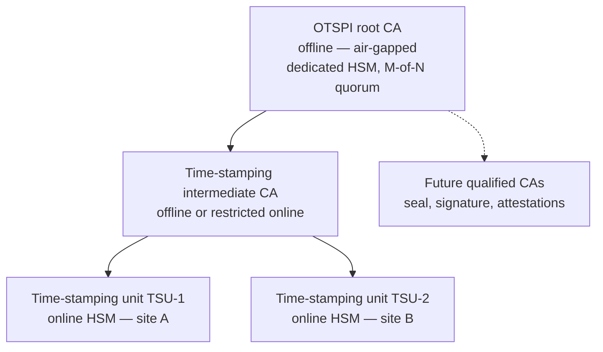
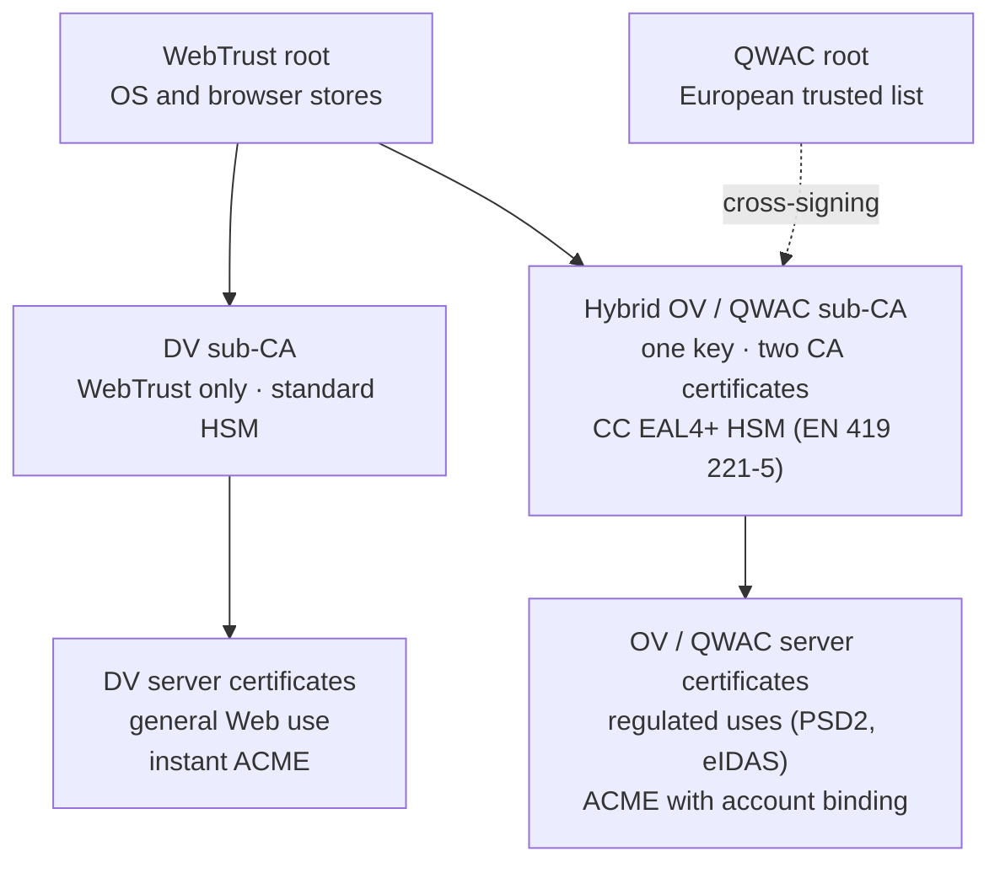

{ .wp-cover-logo }

White paper

A public-interest qualified trust service infrastructure for eIDAS 2.0

Open Trusted Service Provider Initiative (OTSPI) Public consultation document — version 0.9 September 2026

Creative Commons Attribution 4.0 International licence · contact@otspi.org

# OTSPI White Paper
## A public-interest qualified trust service infrastructure for eIDAS 2.0

<a class="md-button md-button--primary" href="otspi-white-paper.pdf" download>Download the reference PDF</a>
<a class="md-button" href="https://github.com/otspi/organisation/discussions/new?category=ideas">Comment on the white paper</a>

| | |
|---|---|
| **Issuer** | Open Trusted Service Provider Initiative (OTSPI), non-profit association under the French law of 1901, currently being formed |
| **Document status** | Public consultation document — version 0.9 |
| **Date** | September 2026 |
| **Intended readers** | Public administrations, policy makers, supervisory bodies, conformity assessment bodies (CABs), hosting providers, research laboratories, the open source ecosystem |
| **Licence** | Creative Commons Attribution 4.0 International (CC-BY-4.0) |
| **Contact** | [contact@otspi.org](mailto:contact@otspi.org) |

!!! note "Nature of this document"
    This white paper sets out an intention and a target architecture. It is neither a Time-Stamping Policy, nor a Certification Practice Statement (CPS), nor a contractual service commitment. References to products or suppliers are given for information only; their final selection will be subject to competitive procedures and to the approval of the Trust Policy Committee (CPC).

    OTSPI is currently being formed: its statutes are still a **draft**, to be put to the vote of the founding general meeting. The statutory safeguards described in this document (entrenched purpose, inalienability, reserve fund, governance) will apply once they have been adopted.

    This English version is a translation of the [French white paper](../livre-blanc/index.md), which is the reference text.

### Contents

- [1. Executive summary](#1-executive-summary)
- [2. Market failure and sovereignty issues](#2-market-failure-and-sovereignty-issues)
- [3. Pilot use case: qualified electronic time-stamping (QTSA)](#3-pilot-use-case-qualified-electronic-time-stamping-qtsa)
- [4. Security architecture and trust model](#4-security-architecture-and-trust-model)
- [5. Business model and sustainability](#5-business-model-and-sustainability)
- [6. Roadmap and call for consultation](#6-roadmap-and-call-for-consultation)
- [Appendix A — Glossary](#appendix-a-glossary)
- [Appendix B — Normative references](#appendix-b-normative-references)
- [Appendix C — Sources and methodology for figures](#appendix-c-sources-and-methodology-for-figures)

---

## 1. Executive summary

-   :material-card-account-details-outline: **Digital identity**

    **D-91**{ .wp-value }

    at the date of publication: by 24 December 2026, each of the 27 Member States must provide a European Digital Identity Wallet[^eudi].

-   :material-file-document-outline: **E-invoicing**

    **10 million**{ .wp-value }

    economic actors in France affected by mandatory e-invoicing[^eco].

-   :material-currency-eur: **Cost of proof**

    **€10,000 excl. VAT / year**{ .wp-value }

    to time-stamp 15,000 documents a month with a qualified provider, at public list prices (see § 2.1).

-   :material-lock-open-variant-outline: **OTSPI commitment**

    **€0**{ .wp-value }

    for the baseline service, identical for everyone and with no prior contract; only enhanced commitments involve a contribution (see § 5.4).

-   :material-autorenew: **Web certificates**

    **47 days**{ .wp-value }

    maximum validity in 2029, down from 398 days in 2025: nearly eight renewals per year and per site[^sc081].

-   :material-alert-outline: **Dependency**

    **64 %**{ .wp-value }

    of websites rely on a single certificate authority, established outside the Union[^w3techs].

### 1.1. The situation

Regulation (EU) 2024/1183, known as **eIDAS 2.0**, amending Regulation (EU) No 910/2014, brings trust services into everyday use. The timetable is now set by the implementing acts adopted in November 2024[^eudi]:

- **24 December 2026**: each Member State must make available at least one **European Digital Identity Wallet (EUDI Wallet)** (Article 5a);
- **24 December 2027**: private relying parties required to use strong authentication (banking, energy, transport, health, telecommunications, education, digital infrastructure, etc.), with the exception of micro and small enterprises, must accept it at the user's request (Article 5f).

These deadlines will multiply the need for qualified electronic signatures, seals, time-stamps and attestations.

The European market for **Qualified Trust Service Providers (QTSPs)** includes a significant number of operators: as of 24 September 2026, the national trusted lists of the EEA list **280 QTSPs** with at least one active qualified service, **158 of which offer a qualified electronic time-stamping service**[^tl]. The bottleneck is therefore not the number of providers, but the **uniformity of their access model**:

- proprietary interfaces wrapping standard protocols;
- per-unit pricing (per token, per transaction or per signature), often combined with a subscription and set-up fees;
- systematic prior contracting, ill-suited to automated, high-volume, low-value uses;
- markets largely fragmented by Member State, despite the mutual recognition provided for by the Regulation.

### 1.2. The thesis

Without a qualified infrastructure that is **non-commercial, open and automatable through APIs**, eIDAS 2.0 risks failing to reach those who have neither the budgets nor the legal teams to negotiate with commercial QTSPs: SMEs, local authorities, higher education and research institutions, associations, and the whole free software ecosystem.

The issue goes beyond cost: it concerns **citizens' independence** in their digital interactions and the **freedom to do business**. Mandatory e-invoicing (since 1 September 2026 in France), European digital identity and the forthcoming business wallets pave the way for end-to-end automation of exchanges between citizens, businesses and administrations. This streamlining will only benefit everyone if the evidential building blocks underpinning it are available with no entry fee (see § 2.3).

The evidential value conferred by the Regulation — presumption of accuracy of the date and time for qualified time-stamps (Article 41), legal equivalence of the qualified signature with a handwritten signature (Article 25) — would otherwise remain the preserve of the best-resourced organisations.

### 1.3. The response

OTSPI proposes to set up a **public-interest QTSP**, run by a non-profit, public-interest association currently being formed, whose:

- entire software stack is published under the **European Union Public Licence (EUPL 1.2)**, a free copyleft licence, and remains auditable by all;
- governance applies strict segregation of duties in line with ETSI EN 319 401;
- services are exposed through standard APIs (RFC 3161, ETSI EN 319 422, ACME), with no per-unit pricing for public-interest uses;
- scope covers, in line with its statutory purpose, the entire chain of trust: identity management, public key infrastructures, time-stamping, sealing, signature, evidential archiving and validation of evidence;
- **draft statutes** make the public-interest purpose, non-profit management and inalienability of assets **unamendable**, and permanently forbid any conversion into a for-profit entity: the infrastructure is designed as a **digital and identity commons**, protected against any capture (see § 5.2).

The first service targeted is **qualified electronic time-stamping** (QTSA), compliant with ETSI EN 319 421 and ETSI EN 319 422.

The second axis is a **European TLS certificate authority** with two branches: a **DV** branch, audited under WebTrust, fully automated through ACME and with no prior account; and an **OV / QWAC** branch, whose certificates are recognised both by browsers and as eIDAS qualified certificates. The scheduled reduction of TLS certificate validity to 47 days by 2029 makes automation a de facto requirement for every European website (see § 2.4).

Qualified electronic seals and signatures, and identity services built on the EUDI Wallet and business wallets, will follow as parallel work streams (see § 2.5 and § 6.1).

### 1.4. The precedent

In 2015, the TLS certificate market showed comparable characteristics: high prices for a technically automatable act, manual procedures, and, as a result, fewer than 30 % of Web page loads encrypted. The **Internet Security Research Group (ISRG)**, a non-profit organisation, issued the first **Let's Encrypt** certificate on 14 September 2015, basing its model on three principles: free of charge, automation (the ACME protocol, since standardised as RFC 8555) and transparency. Ten years later, around 80 % of page loads are encrypted worldwide (nearly 95 % in the United States), and Let's Encrypt frequently issues more than ten million certificates a day for nearly one billion websites[^le].

OTSPI applies this approach to eIDAS qualified services, while fully accepting the structural differences between the two contexts (see § 2.6).

!!! abstract "Summary"
    - **Problem**: eIDAS 2.0 makes qualified services a general need (deadlines: December 2026 and December 2027), in a market whose 280 operators share the same closed, contract-based, per-unit pricing model.
    - **Consequence**: de facto exclusion of SMEs, local authorities, universities and open source projects.
    - **Proposal**: a non-profit QTSP with open code and public governance, covering the entire chain of trust, protected by entrenched draft statutes that will make it an inalienable digital commons.
    - **First service**: qualified electronic time-stamping (ETSI EN 319 421 / 422, RFC 3161).
    - **Next axes**: a European TLS certificate authority audited under WebTrust (DV / OV); seals, signatures and identity in parallel.
    - **Societal stakes**: citizens' independence and freedom to do business as e-invoicing and digital identity become widespread.
    - **Methodological reference**: ISRG / Let's Encrypt.

---

## 2. Market failure and sovereignty issues

### 2.1. Commercial offerings do not meet the needs of open source and public innovation

The current offering of commercial QTSPs was designed for large corporate customers and transactional signing workflows. It poorly serves three categories of needs that are nonetheless structural for eIDAS 2.0.

**a) High-volume automated integration.**
A continuous integration pipeline that time-stamps every build artefact, an electronic archiving system that seals every deposit, or a code hosting platform that time-stamps every release tag generates high volumes of low-value operations. Per-token pricing makes these uses economically irrational, even though they form the foundation of long-term digital evidence.

The public price lists of QTSPs listed on the trusted lists give an order of magnitude:

| Provider (State) | Public pricing model | Indicative unit cost (excl. VAT) |
|---|---|---|
| Datasure (FR)[^datasure] | €199 set-up + €49/month + decreasing usage fees | from €0.15 to €0.03 per token |
| Disig (SK)[^disig] | Prepaid bundles valid for 365 days, from 100 to 10,000 tokens | from €0.117 to €0.050 per token |

*Illustration.* A continuous integration pipeline issuing **15,000 time-stamps per month** — a modest volume for an active open source project or a departmental archiving service — costs, under the first price list, **€829 excl. VAT per month**, i.e. nearly **€10,000 excl. VAT per year**, excluding set-up fees. None of the offerings examined for this document provides a public, free qualified endpoint that requires no prior contract.

**b) Interoperability and reversibility.**
Many offerings expose proprietary APIs, wrapping standard protocols in provider-specific layers (authentication, envelope format, quota management). The resulting exit cost creates a dependency that runs counter to the Regulation's interoperability objective.

**c) No reusable trust building blocks.**
Free software — signing libraries, software supply chain tools, archiving systems — cannot integrate a qualified service "by default", for lack of a public, stable endpoint available without prior contracting. Every integrator has to negotiate access individually, which rules out any network effect.

### 2.2. Risk of rent-seeking and technological dependency

Entering the qualified services market is costly: conformity assessment by an accredited body, purchase of certified cryptographic modules, secure hosting, financial guarantees (Article 24(2) of the Regulation), and qualified staff. These barriers to entry, legitimate given the security requirements, are passed on in unit prices and steer all operators towards the same commercial model.

The distribution of providers also reflects strong national fragmentation: of the 158 time-stamping QTSPs identified, 38 are on the Spanish trusted list, 17 on the Italian list and 15 on the French list, while several States have only one or none[^tl]. The mutual recognition provided for by the Regulation has not led to the emergence of a common infrastructure at Union level.

Under eIDAS 2.0, this situation presents three risks:

1. **Rent-seeking**: the regulatory expansion of demand, without any change in the access model, results in continued per-unit pricing of acts whose marginal cost tends towards zero.
2. **Technological dependency**: control of trust building blocks by actors whose decision centres, software supply chains or shareholding may lie outside the European framework is a sovereignty issue, particularly for public administrations.
3. **Unequal access to evidence**: qualified evidential value becomes a competitive advantage reserved for well-resourced actors, at the expense of equality before digital evidence.

### 2.3. Citizen independence and freedom to do business

Digital trust is no longer a niche market. It is becoming a condition for exercising ordinary rights and activities: identifying oneself, contracting, invoicing, archiving, proving. When access to the building blocks that make these acts enforceable depends exclusively on commercial intermediaries, two freedoms are affected: **citizens' autonomy** in their digital interactions, and **the freedom to do business**, that is, the ability to create new services without first paying an entry fee.

#### a) The example of mandatory e-invoicing

The generalisation of electronic invoicing between VAT-registered businesses in France illustrates this shift:

- since **1 September 2026**, all businesses concerned must be able to **receive** electronic invoices, and large and intermediate-sized enterprises must **issue** them;
- on **1 September 2027**, the issuing obligation extends to SMEs and micro-businesses;
- issuing, transmission and receipt must go through an **approved platform** registered by the tax administration (Article 289 bis of the French General Tax Code, CGI), which also transmits invoicing data to the administration (Article 289 E of the CGI)[^fe];
- at Union level, the "VAT in the Digital Age" (ViDA) directive, published in the *Official Journal* on 25 March 2025, extends structured e-invoicing to intra-Community transactions from **1 July 2030**[^vida].

Tax law also requires the **authenticity of origin**, **integrity of content** and **legibility** of each invoice to be guaranteed until the end of its retention period (Article 233 of Directive 2006/112/EC, transposed in Article 289, VII of the CGI). The accepted means include the qualified electronic signature and, since Decree No 2023-377 of 16 May 2023, the **qualified electronic seal**[^cachet].

The reform does not make qualified services mandatory. It does, however, make them one of the recognised means of proof, and it imposes a compliance obligation on the entire economy, including the smallest businesses. For a craftsperson, an employing association or a publisher of free business software, the ability to seal, time-stamp and archive an invoice in an evidentially sound way should not depend on subscribing to a single provider.

#### b) The arrival of European digital identity

The EUDI Wallet is a significant step forward for citizens' autonomy: it is provided free of charge to natural persons, under their sole control, with selective disclosure of attributes. The Regulation also provides that it must allow signing by means of a **free qualified electronic signature**, with Member States able to restrict this free use to **non-professional purposes** (Article 5a)[^wallet].

This restriction precisely outlines the area of market failure: the self-employed worker, the micro-entrepreneur, the start-up or the association acting in a professional capacity falls back into the commercial model as soon as it leaves the private sphere. The proposed regulation on **European Business Wallets**, presented by the Commission on 19 November 2025, provides that these wallets will allow documents to be signed, sealed and time-stamped and verified data to be exchanged with administrations[^ebw]. Its implementation presupposes the prior existence of qualified services accessible at a sustainable cost.

#### c) Seizing the opportunity of automation and streamlining

The convergence of these three developments — digital identity, e-invoicing, business wallets — opens up a rare opportunity: **removing the breaks** between identifying a party, drawing up an act, transmitting it and archiving it with evidential value. A fully automated chain becomes conceivable:

1. identification of the counterparty by a verifiable attestation from a wallet;
2. issuing of the structured invoice and transmission through an approved platform;
3. qualified sealing and time-stamping on the fly, without human intervention;
4. transfer to electronic archiving with enforceable proof of integrity for the entire retention period.

This streamlining is only accessible to everyone if steps 3 and 4 rely on **cryptographic primitives exposed through standard APIs, with no per-transaction pricing and no prior contract**. Otherwise, automation remains reserved for organisations able to absorb the marginal cost of each operation, and innovation — new business software, new platforms, local digital public services — runs into a barrier to entry that has no technical justification.

This is precisely the foundation that OTSPI proposes to provide, starting with qualified time-stamping and gradually extending the service to qualified electronic seals and signatures, evidential archiving and validation.

### 2.4. TLS certificates: the opportunity for a European WebTrust-audited authority

#### a) An automation constraint that is now unavoidable

In April 2025, the CA/Browser Forum unanimously adopted ballot SC-081v3, which gradually reduces the maximum validity period of public TLS certificates[^sc081]:

| Certificates issued on or after | Maximum validity |
|---|---|
| 15 March 2026 | 200 days |
| 15 March 2027 | 100 days |
| 15 March 2029 | 47 days |

The periods during which a domain validation can be reused are also reduced, down to 10 days in 2029, and the reuse period for organisation information is cut to 398 days. By 2029, manually renewed certificates become unmanageable: **automation through the ACME protocol** (RFC 8555) is no longer a convenience but an operating requirement for every administration, local authority, hospital, university or SME with a website.

#### b) An existing but shallow and fragile European offering

Several European certificate authorities already offer automated issuance: Actalis (Italy) issues free and unlimited DV certificates via ACME[^actalis], and HARICA (Greece), an authority rooted in the academic world, offers ACME issuance covering in particular the DV and OV levels[^harica]. These initiatives confirm that automated European issuance is feasible.

The offering nevertheless remains narrow, and its sustainability depends on commercial models. Buypass (Norway), which had for several years operated a free DV offering via ACME, stopped issuing TLS certificates on 31 October 2025, considering the activity no longer viable given the market situation and the regulatory framework[^buypass]. Users of the service had to migrate to another provider within tight deadlines.

Let's Encrypt, operated by an organisation established in the United States, is today the certificate authority of 67.4 % of websites whose authority is known, i.e. 64.2 % of all websites[^w3techs]. This is not a malfunction in itself: Let's Encrypt is an exemplary commons. It nevertheless constitutes a **single point of dependency** for a critical function of the European Internet.

#### c) What OTSPI can bring

A TLS certificate authority operated by OTSPI would stand out on four points:

1. **Non-commercial sustainability**: continuity of service does not depend on a profitability trade-off, and the termination plan is funded by a ring-fenced reserve (Article 12 bis of the draft statutes).
2. **European governance and hosting**: operated by an association under French law, with infrastructure hosted exclusively within the Union and fully open source code.
3. **Two issuing branches, two levels of requirements**: a **DV** branch, under the WebTrust framework only and outside the eIDAS scope, issues instantly and in a fully automated way; a hybrid **OV / QWAC** branch, subject to a dual WebTrust and ETSI EN 319 411-2 audit, issues certificates recognised both by browsers and as **qualified website authentication certificates (QWACs)** within the meaning of Article 45 of the eIDAS Regulation, following the so-called "1-QWAC" model of the ETSI TS 119 411-5 specification[^qwac]. This separation protects the qualified service: an incident on the DV branch has no effect on eIDAS compliance.
4. **Organisation validation automated after a one-time onboarding**: OV / QWAC issuance goes through ACME with External Account Binding (RFC 8555). The organisation is verified only once, during a prior onboarding (identity of the legal person and mandate of its representative), eventually relying on attestations issued by European business wallets and on official registers, subject to their eligibility as reliable data sources within the meaning of the CA/Browser Forum *Baseline Requirements*. Renewals are then fully automated.

!!! warning "Accepted constraints"
    - **Dedicated hierarchy**: the Chrome root program only accepts hierarchies dedicated exclusively to TLS server authentication, with automated issuance and renewal for each certificate policy[^chrome]. The OTSPI TLS authority will therefore rely on a **separate WebTrust root**, distinct from the qualified roots (see § 4.1).
    - **Third-party decisions**: including a new root in the trust stores of browsers and operating systems takes several years, followed by the time needed to roll out updates. Inclusion is the sole decision of the root programs.
    - **No cross-signing shortcut**: cross-signing by an already trusted authority is not a practicable way in. Chrome prohibits its members from issuing a cross-certificate to an operator absent from its store without its express approval, and Mozilla subjects such an operation to its own review process, the signing authority remaining fully accountable for the certificates issued[^xsign]. Until the OTSPI root is included, the TLS service therefore remains limited to a test environment.
    - **Sequencing**: this work stream follows the qualification of the time-stamping service (see § 6.1, phase 4). It will not take resources away from the pilot service.

### 2.5. Statutory scope and sequencing

OTSPI's purpose is defined in Article 2 of its [draft statutes](../statuts/statuts-association.md) (in French), declared unamendable. It is not limited to a technical layer: it covers the entire digital chain of trust, together with the dissemination, research and training activities that enable its adoption.

| Statutory mission (Article 2) | Operational implementation | Horizon |
|---|---|---|
| **1. Operating trust services** | Qualified electronic time-stamping (RFC 3161, ETSI EN 319 421 / 422) | Pilot service |
| | Public key infrastructures, automated DV and OV TLS certificates (ACME) | Medium term |
| | Qualified electronic seals and signatures, including remote signing | Medium term |
| | Qualified electronic archiving, preservation and validation of evidence (signatures, seals, time-stamps) | Medium term |
| | Identity management: electronic attestations of attributes, integration building blocks for the EUDI Wallet and business wallets, identity verification | Medium term |
| **2. Qualifications and certifications** | Applications for eIDAS qualification to the supervisory body, WebTrust audits, applications for inclusion in browser root programs | Ongoing |
| **3. Open technologies** | Publication of the entire stack under the EUPL 1.2: servers, client libraries, verification tools, transparency logs, specifications | Ongoing |
| **4. Research, training, standardisation** | Training of Authority Officers and integrators, contributions to ETSI, IETF and CA/Browser Forum work, post-quantum cryptography | Ongoing |
| **5. Digital resilience** | Interoperability, reversibility, combating proprietary lock-in, continuity guaranteed by the termination plan | Ongoing |

Three principles govern the roll-out of this scope:

- **Sequencing by mastery**: each new service opens only once the previous one has reached its target qualification level and demonstrated its operational stability. Qualified time-stamping comes first because it focuses the effort on time accuracy and key protection (see § 3.1).
- **Identity in parallel**: given the EUDI Wallet deadlines (December 2026 and December 2027) and the proposed business wallets, work on identity management is carried out at the same time as work on qualified seals and signatures, not afterwards. These services share the same foundations: public key infrastructure, HSMs, key governance and verification of persons.
- **Neutrality and universal access**: in accordance with Article 12 quater of the draft statutes, OTSPI's services and software building blocks are available on a universal, neutral and non-discriminatory basis. Administrations, citizens, associations, free software projects and commercial vendors access them on the same terms. OTSPI does not seek to displace existing actors: it establishes an open and reusable **common reference foundation** on which everyone, including vendors of commercial solutions, can build their own services.

### 2.6. Scope and limits of the Let's Encrypt comparison

The comparison with Let's Encrypt is methodological, not literal. Three differences are fully acknowledged:

- **Liability regime**: a QTSP is liable under Article 13 of the eIDAS Regulation and must demonstrate adequate financial resources or insurance. A domain-validated TLS certificate carries no equivalent legal presumption.
- **Regulatory supervision**: qualified status is granted and supervised by the national supervisory body (in France, ANSSI), on the basis of a conformity assessment report produced at least every twenty-four months.
- **Fixed costs**: audit, hosting and physical security costs are structurally higher than for a Web certificate authority.

These differences justify starting with a single service with low operational friction, and a mixed funding model (see § 5).

!!! abstract "Summary"
    - Commercial offerings are ill-suited to automated, high-volume, low-value uses: from €0.03 to €0.15 excl. VAT per token, i.e. nearly €10,000 excl. VAT per year for 15,000 time-stamps a month.
    - The market is fragmented by Member State and offers no open common infrastructure.
    - eIDAS 2.0 expands demand without changing the access model: risk of rent-seeking, dependency and unequal access to evidence.
    - Mandatory e-invoicing and the EUDI Wallet make end-to-end automation possible, provided that the evidential building blocks are available with no entry fee.
    - Reducing TLS certificate validity to 47 days by 2029 makes automation mandatory; a European offering exists but remains narrow and fragile (Buypass withdrawal in 2025).
    - A non-profit European TLS authority with two branches — DV automated under a WebTrust root, hybrid OV / QWAC recognised by browsers and as a qualified certificate — is a second medium-term axis; its recognition by browsers depends on the inclusion of its root, with no shortcut.
    - The statutory scope covers the entire chain of trust (identities, PKI, time-stamping, seals, signatures, archiving, validation), rolled out step by step starting with qualified time-stamping. Identity management is carried out in parallel with seals and signatures, in step with the EUDI Wallet deadlines.
    - Universal, non-discriminatory access: OTSPI provides a common foundation on which all actors, including commercial ones, can build.

---

## 3. Pilot use case: qualified electronic time-stamping (QTSA)

### 3.1. Rationale

Qualified electronic time-stamping has been chosen as the first service for four reasons.

1. **Operational simplicity.** The service requires no identity verification of natural persons: it involves no remote identity verification process, no biometric capture and no management of registration files. The personal data footprint is almost nil: the service receives a cryptographic fingerprint (hash), not the document itself.
2. **Focus on two manageable fundamentals.** Service quality relies on **time accuracy** and **protection of the signing key**, two areas of systems and cryptographic engineering where a small, rigorous team can demonstrate a verifiable level of excellence.
3. **Immediate legal value.** Article 41(2) of the eIDAS Regulation gives qualified time-stamps a presumption of accuracy of the date and time they indicate and of integrity of the data to which they relate, with mutual recognition across all Member States.
4. **A cross-cutting building block.** Time-stamping is a prerequisite for long-term signatures and seals (AdES `-T`, `-LT`, `-LTA` levels), evidential archiving and software supply chain traceability.

### 3.2. Target standards and frameworks

| Framework | Subject |
|---|---|
| Regulation (EU) No 910/2014 as amended by Regulation (EU) 2024/1183 — Articles 41 and 42 | Legal effects of and requirements for qualified electronic time-stamps |
| **ETSI EN 319 401** | General policy requirements for all trust service providers |
| **ETSI EN 319 421** | Policy and security requirements for time-stamping authorities (TSAs) |
| **ETSI EN 319 422** | Time-stamping protocol and time-stamp token profiles |
| **IETF RFC 3161** (updated by RFC 5816) | Time-Stamp Protocol |
| ETSI EN 319 411-1 / EN 319 412 | Policy and profiles for time-stamping unit (TSU) certificates |
| ETSI TS 119 312 | Cryptographic suites |
| ETSI EN 319 403-1 | Requirements for conformity assessment bodies |

The service will be operated under the **Best Practices Time-Stamp Policy** (OID `0.4.0.2023.1.1`) of ETSI EN 319 421, which in particular requires clock accuracy of one second or better relative to Coordinated Universal Time (UTC).

### 3.3. Time source and traceability to UTC

Time accuracy is at the heart of the value of a time-stamping service. The target architecture relies on a redundant, monitored reference chain:

- **Multi-constellation GNSS primary reference**: time receivers using Galileo and GPS simultaneously, relying on Galileo's navigation message authentication service (**OSNMA**), declared operational on 24 July 2025[^osnma], to reduce exposure to spoofing.
- **Holdover oscillators**: high-stability local clocks (OCXO or rubidium) maintaining the declared accuracy if the GNSS signal is lost or jammed.
- **Internal distribution**: stratum 1 time servers distributing time to the time-stamping units via **PTP (IEEE 1588)** over a dedicated network, with authenticated NTP (NTS, RFC 8915) as a fallback.
- **Independent cross-checking**: continuous comparison with independent external sources, the aim being documented traceability to a national realisation of UTC, such as UTC(OP) maintained by LNE-SYRTE.
- **Safety stop**: in accordance with ETSI EN 319 421, any time-stamping unit whose deviation from UTC exceeds the declared accuracy automatically stops issuing tokens; the event is logged and notified.
- **Leap second handling**: a documented and tested procedure, published in the Time-Stamping Policy.

The declared contractual accuracy will be one second, in line with the ETSI policy; the internal operational target, measured and published, is in the order of a millisecond.

### 3.4. Concrete use cases

**a) Qualified time-stamping of the software supply chain.**
Software artefact signing tools such as Sigstore support RFC 3161 time-stamping. A public, free qualified endpoint would allow European open source projects to attach legally enforceable proof of prior existence to every release, consistent with the traceability obligations introduced by the **Cyber Resilience Act (Regulation (EU) 2024/2847)**.

**b) Evidential archiving for local authorities and public bodies.**
Electronic archiving systems compliant with NF Z42-013 / ISO 14641 use time-stamping to establish the integrity and date of deposits. A shared service without per-unit billing removes a direct budgetary obstacle for small and medium-sized local authorities.

**c) Time-stamping of sovereign digital transactions and acts.**
Tender submissions in electronic public procurement, registers of deliberations, proofs of deposit in research (electronic lab notebooks, research data deposits), proofs of prior art in intellectual property.

**d) Long-term validity of signatures and seals.**
Any vendor of a signing solution, commercial or free, can rely on the service to produce signatures from level `-T` to `-LTA` without any prior contractual relationship, within the limits of a fair use policy.

!!! abstract "Summary"
    - Service chosen for its simplicity (no identity verification), its legal value (Article 41) and its cross-cutting nature.
    - Target compliance: ETSI EN 319 401, 319 421, 319 422; RFC 3161; BTSP policy.
    - Time source: GNSS Galileo (OSNMA) + GPS, holdover, PTP, cross-checking, automatic safety stop.

---

## 4. Security architecture and trust model

### 4.1. Certification hierarchy

- The **root CA key** is only used during scheduled ceremonies: issuing or renewing intermediate CAs, issuing the root CA's CRLs.
- Each **time-stamping unit (TSU)** has its own key, reserved exclusively for signing time-stamp tokens, generated and stored in a certified cryptographic module.
- The usage period of TSU keys is shorter than the validity of their certificate, in accordance with ETSI EN 319 421, so that tokens issued at the end of the period remain verifiable.
- The future **qualified CAs** for seals, signatures and attestations (see § 6.1, phase 5) will be attached to this same qualified root, each under an intermediate CA dedicated to a single use.
- The future TLS certificate service (see § 2.4) relies on **two roots distinct** from the qualified time-stamping root: a **WebTrust root**, intended for the trust stores of operating systems and browsers, and a **QWAC root**, listed on the European trusted list. They apply the same governance principles (air gap, quorum, ceremonies) and share no key with the time-stamping, seal or signature CAs.

| Branch | Scope and audits | Profile | Issuance flow |
|---|---|---|---|
| **DV** | WebTrust only, outside the eIDAS scope | Pure DV (RFC 5280, CA/Browser Forum *Baseline Requirements*) | 100 % automated through ACME (`http-01` / `dns-01` challenges), with no prior account or legal verification |
| **OV / QWAC** | Dual WebTrust for CAs / BR and ETSI EN 319 411-2 audit; listing on the European trusted list | OV with eIDAS `qcStatements`; ETSI TS 119 495 profile for PSD2 uses | ACME with External Account Binding (EAB) after onboarding of the organisation (identity and legal mandate); automated renewals |

The **hybrid OV / QWAC sub-CA** has a single private key, stored in an HSM certified CC EAL4+ against EN 419 221-5, associated with two intermediate CA certificates: one signed by the WebTrust root, the other by the QWAC root. Each server certificate is issued only once and validates along whichever path each piece of software recognises: the WebTrust path for mainstream browsers, the QWAC path for regulated applications relying on the European trusted list. The DV sub-CA, by contrast, depends only on the WebTrust root, which keeps it entirely outside the qualified scope.

Algorithms and key sizes follow ETSI TS 119 312 and ANSSI recommendations, as defined in the [CP/CPS framework](../cadrage/cp-cps-cadre.md) (in French); the CPC monitors a migration path towards hybrid post-quantum schemes.

### 4.2. Cryptographic isolation

All OTSPI private keys are generated, stored and used exclusively in **hardware security modules (HSMs)**:

- certified **Common Criteria EAL4 augmented (AVA_VAN.5)** against the **CEN EN 419 221-5** protection profile (*Cryptographic Module for Trust Services*);
- listed, where the configuration allows, on the European list of certified devices notified under Articles 30 and 31 of the eIDAS Regulation;
- for information, product lines meeting these requirements include Utimaco CryptoServer CP5, Thales Luna 7 and Securosys Primus X.

Additional principles:

- no private key ever leaves the HSM boundary in clear;
- key backups are encrypted under protection keys that are themselves split between security officers;
- HSM administration is subject to dual control and strong smart-card authentication;
- production HSMs are dedicated to OTSPI (no partition sharing with third parties).

### 4.3. Physical hosting

- **Two geographically separate sites**, located within the European Union, in active/active configuration for the time-stamping units;
- colocation in data centres certified **ISO/IEC 27001** and compliant with **EN 50600**, with private locked racks, named access control, video surveillance and access logging;
- preference for hosting providers holding the ANSSI **SecNumCloud qualification** for the associated infrastructure services, and subject exclusively to European law;
- root CA equipment kept offline, in an access-controlled safe separate from the production sites.

!!! info "A note on terminology"
    Common Criteria certification (EAL4+) applies to **products** (HSMs), whereas ISO/IEC 27001 and the SecNumCloud qualification apply to **organisations** and **services**. OTSPI takes care not to confuse these assurance levels in its audit documentation.

### 4.4. Root key governance

Compromise or loss of the root CA key is the most critical risk for a QTSP. Its governance rests on the following principles.

**a) Strictly offline (air gap).**
The root CA HSM is never connected to a network. Data exchanges (certification requests, CRLs) go through controlled removable media, whose fingerprint is verified and recorded in the ceremony minutes.

**b) M-of-N hardware quorum.**
Activating the root key requires the simultaneous presentation of **M smart cards out of N** (reference configuration: **3 out of 5**), held individually by separate security officers. This configuration ensures both that:

- no coalition of fewer than M officers can activate the key;
- the simultaneous unavailability of N − M officers (i.e. 2 in the reference configuration) does not compromise continuity.

No officer may hold more than one card. Card holders are authorised under the supervision of the CPC (Article 8 bis of the draft statutes). It is proposed to make this role incompatible with a seat on the Executive Board, consistently with the statutory incompatibility between the Executive Board and the CPC.

**c) Key ceremonies.**
Each ceremony follows a script approved in advance by the CPC, takes place in the presence of an independent witness, is fully video-recorded and is documented in minutes signed by all participants, published without any secret element.

**d) Disaster recovery through notarial escrow.**
To prevent the permanent loss of the quorum (death, vacancy, long-term incapacity of several officers), a set of backup cards is placed **under seal with separate notarial offices**:

- each office holds only a fraction strictly below the quorum;
- release of the cards is subject to an **exclusive activation clause**, strictly defined in the deposit deed: formal finding of vacancy or long-term incapacity of a number of officers making the quorum unattainable, following a joint decision of the CPC and the Board of Directors;
- the integrity of the seals is checked periodically, and any broken seal triggers a security incident procedure and the renewal of the secrets concerned;
- released cards are only used during a formal ceremony, under the same witnessing and traceability conditions as an ordinary ceremony.

### 4.5. Transparency and auditability

Public auditability is a founding principle of OTSPI (see the [Code of Ethics](../gouvernance/charte-ethique.md), in French). It takes the following forms.

**a) Transparency log of issued tokens.**
Every time-stamp token issued is recorded in an **append-only log based on a Merkle tree**, following the principles proven by Certificate Transparency (RFC 9162). The log periodically publishes a signed root and allows any third party to obtain an inclusion proof and a consistency proof. Only the serial number and the fingerprint of the token are recorded in the log, not the fingerprint submitted by the requester, to prevent any inference on low-entropy data.

**b) Open source code.**
The entire application stack (RFC 3161 front end, HSM orchestration, time monitoring, transparency log, verification tools) is developed in **Go** and **Rust**, and published under the **EUPL 1.2**. This copyleft licence ensures that any modified and distributed version, including when made available as a network service, remains free. It is compatible with the GNU AGPL v3, which allows components under that licence to be integrated or combined. A permissive licence, which would allow improvements to be taken proprietary, has been deliberately ruled out. Builds are reproducible and deployed binaries are linked to their source code by signed provenance.

**c) Public normative documentation.**
The Time-Stamping Policy and the **Certification Practice Statement (CPS)** are structured according to **RFC 3647** and published in full, as are the [Information Systems Security Policy](../cadrage/pssi.md) and the [Termination Plan](../cadrage/termination-plan.md) (in French).

**d) Publication of audit results.**
Conformity assessment attestations, summaries of internal audits and reports on significant incidents (once resolved) are published.

!!! abstract "Summary"
    - Keys exclusively in HSMs certified against EN 419 221-5 (CC EAL4+ AVA_VAN.5).
    - Two European sites certified ISO/IEC 27001; offline root CA in a separate safe.
    - Root key: air gap, 3-of-5 quorum, scripted and witnessed ceremonies, notarial escrow split under an exclusive activation clause.
    - Transparency: verifiable Merkle log, fully open code, public RFC 3647 CPS, published audit results.

---

## 5. Business model and sustainability

### 5.1. Legal status

OTSPI is being formed as an **association under the French law of 1 July 1901**, non-profit and managed on a voluntary, disinterested basis. Its draft statutes will be put to the vote of the founding general meeting, before the association is declared to the prefecture. The association will have a purpose meeting the public-interest criteria of Articles 200 and 238 bis of the French General Tax Code (subject to confirmation through a tax ruling).

In accordance with Article 24(2) of the eIDAS Regulation, the [draft statutes](../statuts/statuts-association.md) establish a ring-fenced **Operational Reserve and Guarantee Fund** (Article 12 bis), protected from operating creditors, allocated to covering liability and to fully funding the termination plan.

### 5.2. Statutes designed for a digital and identity commons

A trust infrastructure is only valuable if its users can count on its continuity **and** on the stability of its purpose. The history of digital technology includes many open or free projects that were bought out, turned into commercial offerings or abandoned, leaving their users without a solution. For a service carrying legally binding evidence over decades, and eventually identity data, this risk is unacceptable.

OTSPI's draft statutes have therefore been drafted with a **deliberately high degree of rigidity**, so that no temporary majority, no funder and no acquirer can divert the association from its purpose:

| Safeguard | Statutory mechanism |
|---|---|
| **Entrenched purpose** | The public-interest purpose (Article 2) and the continuity clauses (Article 13) are declared permanent and unamendable. |
| **Permanent ban on conversion** | The association may never be converted into a commercial company or any other for-profit entity (Article 13.1). |
| **Inalienable assets** | Free software, trademarks, domain names and operational equipment are irrevocably allocated to the purpose and may not be transferred to a for-profit entity (Article 13.2). |
| **Keys beyond appropriation** | Private keys, root certificates and HSM access are assets held in technical escrow; nobody may claim any private right over them (Article 8 ter). |
| **Amendment all but impossible except by order** | Any statutory amendment requires a quorum of 75 % of full members, **unanimity** of voting full members, and can be rejected by a majority opposition vote of all members, supporting members included (Article 11). Protected articles can only be amended at the order of an audit body, a supervisory authority, the administration or a court, and strictly to the extent required (Article 11 bis). |
| **Structural decisions reserved to members** | Creating, closing or transferring a major trust service or a root infrastructure falls exclusively within the competence of the General Meeting (Article 10). |
| **Strictly non-profit management** | Directors serve on a voluntary basis, employees may not sit on the Executive Board or the Board of Directors, and no surplus may be distributed (Article 12). |
| **Universal access** | Universal, neutral and non-discriminatory access to services, subject only to legally binding sanctions regimes (Article 12 quater). |
| **Guaranteed continuity** | Absolute priority to the termination plan in the event of dissolution, followed by perpetual transfer of assets to a similar public-interest body (Article 13); any successor association must adopt the same protective clauses word for word (Article 13 bis). |
| **Members' counter-power** | Five members are enough to require a General Meeting to be convened on any amendment of the Internal Rules (Article 14). |

These clauses are the institutional equivalent of the cryptographic controls described in § 4: just as no officer can activate the root key alone, **no actor can take over the infrastructure or change its purpose alone**. Should the association be recognised as being of public utility, the supervision of the Conseil d'État would replace these mechanisms as the guarantor of the inalienability of its missions (Article 11 ter). These safeguards will take effect once the statutes are adopted by the founding general meeting.

### 5.3. Seed funding

The seed phase (design, test bench, documentation, first audit) will be funded by:

- **digital commons support schemes**: Sovereign Tech Fund / Sovereign Tech Agency, NLnet funds under the European Commission's Next Generation Internet (NGI) programme, France 2030 calls for projects;
- **in-kind technology sponsorship** from sovereign cloud and hosting companies: provision of colocation space, connectivity, equipment or engineering time, valued and declared under the sponsorship regime;
- **financial sponsorship** from companies and foundations whose activity depends on the availability of an open trust infrastructure.

### 5.4. Sustainable operating model

The target model relies on a range of resources, none of which should represent a share likely to compromise the association's independence:

| Resource | Nature | Counterpart |
|---|---|---|
| **Institutional membership** | Fees from administrations, local authorities, universities, companies | Participation in governance under the statutory conditions; no preferential treatment on the baseline service |
| **Foundation support** | Multi-year operating grants | Public accountability for the use of funds |
| **Service level commitments** | Service agreements for high-volume uses or uses requiring enhanced contractual commitments (availability, support, dedicated endpoints) | Contribution proportionate to the costs incurred |
| **Fair-use public access** | Free endpoint, with no prior contract, subject to published rate limits | None |

The guiding principle is as follows: **the baseline service remains free and identical for everyone**; only additional commitments generating specific costs involve a contribution.

### 5.5. Cost structure and guarantees

The main recurring expense items have been identified and will be set out in a multi-year budget published at the end of Phase 1:

- conformity assessment by an accredited body (initial audit, then assessment at least every twenty-four months) and, for the TLS authority, annual WebTrust audits;
- hosting and connectivity on two sites;
- operational and security maintenance of the HSMs and the time chain;
- professional liability insurance and funding of the reserve fund;
- human resources for operations, security and internal audit.

!!! abstract "Summary"
    - Public-interest association under the French law of 1901, currently being formed, non-profit management, ring-fenced reserve fund.
    - Deliberately rigid draft statutes, to be voted by the founding general meeting: entrenched purpose, permanent ban on for-profit conversion, keys and assets beyond appropriation, amendment only unanimously or at the sole order of a regulator. The infrastructure is a digital and identity commons protected against any capture.
    - Seed funding: digital commons grants and in-kind technology sponsorship.
    - Sustainability: membership, foundations, service agreements for intensive uses; baseline service free and identical for everyone.

---

## 6. Roadmap and call for consultation

### 6.1. Phases

!!! note "Scope of the roadmap"
    The phases below describe the steps OTSPI intends to take. They do not prejudge the participation of the institutions mentioned, their opinions, or decisions that fall within their sole competence: granting qualified status, listing on trusted lists, inclusion in browser root programs. No timetable will be set until those opinions have been gathered.

**Phase 1 — Presenting the project and consolidating governance**

- presenting the white paper to the competent authorities and institutions, to which OTSPI wishes to submit its project for their opinion, in particular **ANSSI**, as the national supervisory body, and the State departments responsible for digital affairs and industrial policy;
- reaching out to the cybersecurity ecosystem and to research laboratories in cryptography, time metrology and systems security;
- setting up the **Advisory Board**, made up of independent figures from public administration, research, audit and the open source ecosystem;
- revising the white paper and the roadmap in the light of the opinions gathered;
- publishing the multi-year budget and the funding plan.

**Phase 2 — Technical test bench and pilot documentation**

- launching a publicly accessible, non-qualified **sandbox environment** exposing the RFC 3161 API and the transparency log;
- validating the time chain and publishing accuracy measurements;
- drafting the **Time-Stamping Policy** and the **pilot CPS** following RFC 3647;
- formal risk analysis (in accordance with ETSI EN 319 401) and implementation of the Information Systems Security Policy;
- key ceremony rehearsals, then the production root CA generation ceremony;
- **early start of identity work**, which requires no qualification: open source libraries for verifying attestations from the EUDI Wallet, participation in standardisation work and European pilots, specification of future attestation services.

**Phase 3 — Conformity assessment and application for qualification**

- initial audit by a **conformity assessment body (CAB) accredited** under ETSI EN 319 403-1;
- submission of the assessment report to the supervisory body, in support of an application for qualified status;
- in the event of a favourable decision by the supervisory body: listing on the **national trusted list (TSL)**, aggregated in the European list of trusted lists (LOTL), then opening of the qualified service in production.

**Phase 4 — European TLS certificate authority**

- generation ceremonies for the WebTrust root, the QWAC root, the DV sub-CA and the hybrid OV / QWAC sub-CA (two CA certificates for the same key);
- application for qualification of the QWAC service (ETSI EN 319 411-2), subject to the decision of the supervisory body, and listing of the QWAC root on the trusted list in the event of a favourable decision;
- launch of the ACME endpoints (RFC 8555) in a test environment: DV issuance without an account, OV / QWAC issuance with External Account Binding after onboarding; move to production once the WebTrust root is included;
- **WebTrust for CAs** and **WebTrust — SSL Baseline with Network Security** audits; disclosure in the CCADB;
- applications for inclusion of the OTSPI TLS root in root programs (Mozilla, Chrome, Apple, Microsoft).

**Phase 5 — Qualified seals, signatures and identity management (parallel work streams)**

*Phases 4 and 5 are not strictly sequential: their launch order will depend on the funding and partnerships secured during phase 1.*

These work streams are carried out simultaneously, as they rely on the same foundations: qualified certification hierarchy, HSMs, key governance and verification of the identity of persons.

- *Seals and signatures*: issuing qualified seal and signature certificates (ETSI EN 319 411-2), then remote management of qualified signature and seal creation devices (Article 29a of the Regulation), enabling automated signing and sealing through an API;
- *Identity*: providing **electronic attestations of attributes**, eventually qualified (Articles 45b to 45f of the Regulation), usable by the EUDI Wallet and business wallets; open integration tools for relying parties, in particular local authorities, educational institutions and associations;
- *Identity verification*: registration procedures meeting the requirements applicable to qualified services, relying primarily on the EUDI Wallet and notified electronic identification means rather than on remote biometric verification.

!!! note "Division of roles in the identity ecosystem"
    Issuing the person identification data (PID) held in the EUDI Wallet is the responsibility of Member States. OTSPI does not intend to take their place: its role is to provide attribute attestation services and open integration building blocks that rely on these wallets.

### 6.2. Call to stakeholders

OTSPI is now seeking contributions from:

- **hosting and sovereign cloud providers**, to provide secure colocation space and connectivity on two sites;
- **research laboratories** in applied cryptography, time metrology and formal methods, for an independent review of the architecture and code;
- **seed partners** — foundations, companies, local authorities — to fund phases 1 and 2;
- **auditors and eIDAS compliance experts**, for a critical review of the normative documents;
- **open source projects** likely to integrate qualified time-stamping, to define use cases and client libraries;
- **business software vendors and approved e-invoicing platforms**, to integrate qualified sealing and time-stamping into invoicing and archiving pipelines;
- **local authorities, educational institutions and EUDI Wallet relying parties**, to define attestation services and integration building blocks.

Beyond these contributions, any person or organisation that shares the principles set out in this document can sign the [**Manifesto for a free and open digital identity**](https://www.otspi.org/en/manifesto.html). Its ten principles — control by the individual, voluntary use of digital tools, open standards and code, trust building blocks available with no entry fee, governance protected from capture — are not specific to OTSPI: they are meant to be shared by all those committed to a European digital identity designed as a common good.

!!! abstract "Get involved"
    - Feedback on this white paper: [open a public discussion](https://github.com/otspi/organisation/discussions/new?category=ideas) (guided form, English welcome)
    - Public support: [sign the Manifesto for a free and open digital identity](https://www.otspi.org/en/manifesto)
    - Documentation and technical review: [public GitHub repository](https://github.com/otspi/organisation)
    - Institutional contacts: [contact@otspi.org](mailto:contact@otspi.org)

---

## Appendix A — Glossary

| Term | Definition |
|---|---|
| **ACME** | *Automatic Certificate Management Environment* (RFC 8555) — protocol for automated certificate issuance and renewal |
| **ANSSI** | French National Cybersecurity Agency, the French supervisory body for trust services |
| **CA** | Certification Authority |
| **CAB** | *Conformity Assessment Body* — accredited conformity assessment body |
| **CCADB** | *Common CA Database* — shared disclosure database for certificate authorities used by root programs |
| **CGI** | French General Tax Code (*Code général des impôts*) |
| **CPC** | OTSPI Trust Policy Committee (*Comité des Politiques de Confiance*, acting as Policy Management Authority) |
| **CPS** | Certification Practice Statement |
| **DV / OV** | Domain Validated or Organization Validated TLS certificates |
| **EAA / QEAA** | Electronic Attestation of Attributes, qualified or not |
| **EAB** | *External Account Binding* (RFC 8555) — binding of an ACME account to an account previously verified by the certificate authority |
| **EUDI Wallet** | European Digital Identity Wallet established by eIDAS 2.0 |
| **GNSS** | *Global Navigation Satellite System* |
| **HSM** | *Hardware Security Module* |
| **LOTL** | *List of Trusted Lists* — European list of trusted lists |
| **OSNMA** | *Open Service Navigation Message Authentication* (Galileo) |
| **PA** | Approved e-invoicing platform (*plateforme agréée*), registered by the French tax administration |
| **PID** | *Person Identification Data* issued in the EUDI Wallet by Member States |
| **PTP** | *Precision Time Protocol* (IEEE 1588) |
| **QSCD** | *Qualified Signature/Seal Creation Device* |
| **QTSA** | *Qualified Time-Stamping Authority* |
| **QTSP** | *Qualified Trust Service Provider* |
| **QWAC** | *Qualified Website Authentication Certificate* (Article 45 of the eIDAS Regulation) |
| **TSL** | *Trusted Services List* — national trusted list |
| **TSU** | *Time-Stamping Unit* |
| **ViDA** | *VAT in the Digital Age* — Directive (EU) 2025/516 |
| **WebTrust** | Audit programme for certification authorities developed by CPA Canada, recognised by browser root programs |

## Appendix B — Normative references

- Regulation (EU) No 910/2014 of 23 July 2014 (eIDAS), as amended by Regulation (EU) 2024/1183 of 11 April 2024 (eIDAS 2.0)
- Regulation (EU) 2024/2847 of 23 October 2024 on cyber resilience (Cyber Resilience Act)
- ETSI EN 319 401 — *General Policy Requirements for Trust Service Providers*
- ETSI EN 319 403-1 — *Requirements for conformity assessment bodies assessing Trust Service Providers*
- ETSI EN 319 411-1 / 411-2 — *Policy and security requirements for TSP issuing certificates*
- ETSI EN 319 412 (parts 1 to 5) — *Certificate Profiles*
- ETSI EN 319 421 — *Policy and Security Requirements for TSP issuing Time-Stamps*
- ETSI EN 319 422 — *Time-stamping protocol and time-stamp token profiles*
- ETSI TS 119 312 — *Cryptographic Suites*
- CEN EN 419 221-5 — *Protection Profiles for TSP Cryptographic Modules — Part 5: Cryptographic Module for Trust Services*
- CA/Browser Forum — *Baseline Requirements for the Issuance and Management of Publicly-Trusted TLS Server Certificates*
- CPA Canada — *WebTrust Principles and Criteria for Certification Authorities*; *SSL Baseline with Network Security*
- Chrome Root Program Policy; Mozilla Root Store Policy
- ISO/IEC 27001:2022 — Information security management systems
- EN 50600 — Data centre facilities and infrastructures
- ETSI TS 119 411-5 — *Policy and security requirements for TSP issuing certificates — Part 5: Recommendations for the recognition of QWACs by web browsers*
- ETSI TS 119 495 — *Certificate profiles and TSP policy requirements for Open Banking* (PSD2)
- ETSI TS 119 431-1 / 431-2 — *Policy and security requirements for TSP components operating a remote QSCD / SCDev*
- European Union Public Licence (EUPL) v1.2 — Commission Implementing Decision (EU) 2017/863
- IETF RFC 3161 / RFC 5816 — *Time-Stamp Protocol (TSP)*
- IETF RFC 3647 — *Certificate Policy and Certification Practices Framework*
- IETF RFC 5280 — *X.509 Public Key Infrastructure Certificate and CRL Profile*
- IETF RFC 8555 — *Automatic Certificate Management Environment (ACME)*
- IETF RFC 8915 — *Network Time Security for NTP*
- IETF RFC 9162 — *Certificate Transparency Version 2.0*
- IEEE 1588 — *Precision Time Protocol*

## Appendix C — Sources and methodology for figures

The figures in this document were collected on 24 September 2026. References are given in the notes below.

!!! info "QTSP count methodology"
    The count was produced by automated analysis of the national trusted lists referenced by the European list of trusted lists (LOTL, `https://ec.europa.eu/tools/lotl/eu-lotl.xml`), i.e. 31 lists from EEA States. Any provider with at least one service with the status `granted` is counted as a QTSP. Any provider with at least one service of type `http://uri.etsi.org/TrstSvc/Svctype/TSA/QTST` with the status `granted` is counted as a time-stamping QTSP. The number of declared services is not used as an indicator, as some lists record each time-stamping unit as a separate service.

[^eudi]: Regulation (EU) 2024/1183, Articles 5a and 5f; implementing regulations of 28 November 2024, in particular (EU) 2024/2977, 2024/2979 and 2024/2982. See EADTrust, [*EUDI Wallet: December 2026 Deadline*](https://www.eadtrust.eu/en/blog/december-2026-deadline-eudi-wallet/).
[^tl]: OTSPI count based on the [European LOTL](https://ec.europa.eu/tools/lotl/eu-lotl.xml) and the national trusted lists, available through the [eIDAS Dashboard](https://eidas.ec.europa.eu/efda/tl-browser/). See the methodology above.
[^le]: Let's Encrypt, [*10 Years of Let's Encrypt Certificates*](https://letsencrypt.org/2025/12/09/10-years), 9 December 2025.
[^datasure]: Datasure, [*Prices — Qualified electronic timestamp*](https://www.datasure.net/en/our-services/eidas-qualified-electronic-timestamp/prices-qualified-electronic-timestamp/). Calculation for 15,000 tokens: 1,000 × 0.15 + 2,000 × 0.10 + 7,000 × 0.04 + 5,000 × 0.03 = €780, plus a €49 subscription.
[^disig]: Disig a.s., [*Price list for qualified electronic timestamps*](https://eidas.disig.sk/en/qualified-electronic-time-stamps/pricelist/).
[^osnma]: EUSPA, [*From Testing to Operations: Galileo OSNMA Service Now Available to Users*](https://www.euspa.europa.eu/newsroom-events/news/testing-operations-galileo-osnma-service-now-available-users).
[^sc081]: CA/Browser Forum, [*Ballot SC081v3: Introduce Schedule of Reducing Validity and Data Reuse Periods*](https://cabforum.org/2025/04/11/ballot-sc081v3-introduce-schedule-of-reducing-validity-and-data-reuse-periods/), April 2025.
[^actalis]: Actalis, [*Free and unlimited DV certificates*](https://www.actalis.com/news/ssl-communications/free-and-unlimited-dv-certificates-actalis-becomes-europes-reference-point-for-acme-based-web-security).
[^harica]: HARICA, [*HARICA Flexible ACME*](https://www.harica.gr/en/harica-flexible-acme/).
[^buypass]: Buypass, [*Discontinues Issuance of TLS/SSL Certificates*](https://www.buypass.com/products/tls-ssl-certificates/discontinues-issuance-of-tls-ssl-certificates).
[^chrome]: Google, [*Chrome Root Program Policy*](https://googlechrome.github.io/chromerootprogram/crp/policy/).
[^w3techs]: W3Techs, [*Usage statistics and market share of Let's Encrypt as SSL certificate authority*](https://w3techs.com/technologies/details/sc-letsencrypt), September 2026. Worldwide data; no public European breakdown has been identified.
[^fe]: French tax administration (DGFiP), [*Facturation électronique : guide pratique de démarrage au 1er septembre 2026*](https://www.impots.gouv.fr/sites/default/files/media/1_metier/2_professionnel/EV/2_gestion/290_facturation_electronique/guide_pratique_facturation_electronique.pdf) (in French); CGI, Articles 289 bis and 289 E.
[^vida]: Council Directive (EU) 2025/516 of 11 March 2025 ("ViDA"), published in the *OJEU* on 25 March 2025. See Norton Rose Fulbright, [*VAT in the Digital Age (VIDA) package finally adopted*](https://www.nortonrosefulbright.com/en/knowledge/publications/7f7569e5/vat-in-the-digital-age-vida-package-finally-adopted).
[^cachet]: [Decree No 2023-377 of 16 May 2023](https://www.legifrance.gouv.fr/jorf/id/JORFTEXT000047558499) on invoices transmitted electronically and secured by means of a qualified electronic signature or seal (in French).
[^wallet]: Regulation (EU) 910/2014 as amended, Article 5a. See the [consolidated text of Articles 5a to 5f](https://www.european-digital-identity-regulation.com/Article_5a_(Regulation_EU_2024_1183).html).
[^ebw]: European Parliament, [*Legislative Train Schedule — European business wallets*](https://www.europarl.europa.eu/legislative-train/theme-a-new-plan-for-europe-s-sustainable-prosperity-and-competitiveness/file-european-business-wallet).
[^qwac]: ETSI, [*TS 119 411-5 V2.1.1 (2025-02)*](https://www.etsi.org/deliver/etsi_ts/119400_119499/11941105/02.01.01_60/ts_11941105v020101p.pdf).
[^eco]: French Ministry of the Economy, [*Tout savoir sur la facturation électronique pour les entreprises*](https://www.economie.gouv.fr/tout-savoir-sur-la-facturation-electronique-pour-les-entreprises) (in French), accessed 24 September 2026.
[^xsign]: Google, [*Chrome Root Program Policy*, version 1.8](https://googlechrome.github.io/chromerootprogram/crp/policy/), § 1.6.1; Mozilla, [*Root Store Policy*, version 3.1](https://www.mozilla.org/en-US/about/governance/policies/security-group/certs/policy/), § 8.4.
